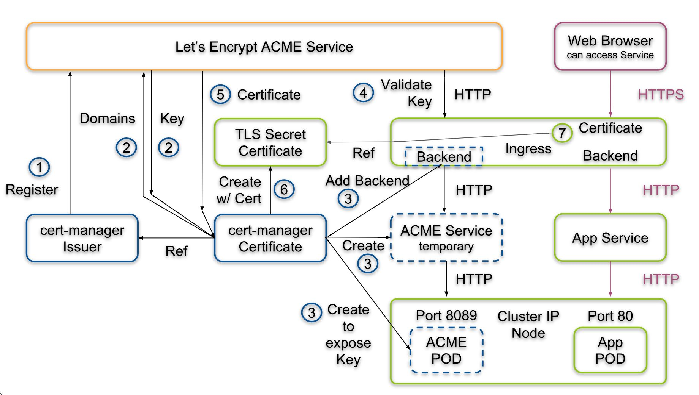

# Paas Tutorial

## Requis

- Un PC / Mac peut importe l'OS
- Des bases d'administration linux
- Un minimum de culture sur les systèmes d'Information
- Connaissance des concepts d'environnements isolés linux ou **containers**
- Un compte [github](http://github.com/)

## Intro

L'objectif de ce tutoriel est de vous permettre de créer sur une petite machine ou sur un serveur personnel un PaaS (Platform as a service) vous permettant de déployer des applications en microservices. Celui-ci sera basé sur [kubernetes](https://kubernetes.io/fr/) pour la conteneurisation et [Kubeapps](https://kubeapps.dev/) pour l'interface de déploiement. En bonus si le temps nous le permet on utilisera concourse pour ajouter l'automatisation des mise à jour de l'application.

L'optique de cet outillage suivra :
- le principle **d'immutable infrastructure** avec l'idée de recréer plutôt que de mettre à jour. Ainsi nous aurons recour à des iso linux déjà prêt pour déployer la plateforme **kubernetes** / **kubeapps** directement sur un serveur.

- Le principe **d'infrastructure as code** en gardant toutes la spécification de notre infrastructure dans des configurations et scripts.

Pour cela nous ferons appel à un socle technique composé de :
- l'outil [`k3s`](https://k3s.io/) qui simplifie l'installation de kubernetes sur des machines ARM tout en restant compatible avec les architectures classiques X64. Il fourni par défaut des pods (containers en execution) pour inclure des fonctionnalités souvent recherchés sur ce type de configuration edge computing. (reverse proxy, configuration DNS...)
- [¨Packer](https://www.packer.io/) pour créer des images iso de machine linux
- [Ansible](https://www.ansible.com/) pour provisioner cette image
- [Azure](https://azure.microsoft.com/fr-fr/) pour nous founir des serveurs accessible en ssh sur lequels nous pourrons mettre en ligne

## 0/ Installer les pré-requis

Pour utilisateurs de **windows** il faut un [**WSL**](https://learn.microsoft.com/fr-fr/windows/wsl/install). 

- Télécharger après avoir suivi cette documentation la distribution linux ``Ubuntu 20.04.5 LTS`` depuis le windows store. 
- **+ Windows terminal bien que pas obligatoire il est très pratique pour accèder au shell**

Ensuite dans vscode installer l'extension wsl `ms-vscode-remote.remote-wsl`.

[**Rancher**](https://rancherdesktop.io/) l'alternative mieux configurée et sans soucis de license à docker desktop. Il est portable sur windows et mac et nous permet d'avoir une expérience docker complète et fonctionnelle sur notre machine.

Dans les choix proposés dans la mise en place :
- **Décocher kubernetes**
- Choisissez **dockerd** comme moteur de conteneurisation

Laissez le ensuite finir de s'initialiser.

# I/ Partie 1 : Provisionning du PaaS sous Linux

### Maintenant tout ce que nous allons faire se trouve dans la ligne de commande sur un shell `bash` ou `zsh` 

**Conda** : [docs.conda.io](https://docs.conda.io/en/latest/miniconda.html). Installer simplement avec le setup `.pkg` pour mac.

> Pour Linux et Windows avec WSL utilisez la ligne de commande ci dessous pour l'installer
```bash
wget https://repo.anaconda.com/miniconda/Miniconda3-latest-Linux-x86_64.sh -P /tmp
chmod +x /tmp/Miniconda3-latest-Linux-x86_64.sh
/tmp/Miniconda3-latest-Linux-x86_64.sh -p $HOME/miniconda
```

> Pour arm :
```bash
wget https://repo.anaconda.com/miniconda/Miniconda3-py39_4.12.0-Linux-aarch64.sh -P /tmp
chmod +x /tmp/Miniconda3-py39_4.12.0-Linux-aarch64.sh
/tmp/Miniconda3-py39_4.12.0-Linux-aarch64.sh -p $HOME/miniconda
```

Veillez à bien accepter toutes les propositions (licence terms, initialize Miniconda3)

**Relancer votre shell pour utiliser conda** (commande `exec $SHELL`)

#### Extensions vscode recommandés : 

  - `redhat.ansible` serveur de langage ansibke
  - `ms-kubernetes-tools.vscode-kubernetes-tools` debug des cluster directement depuis l'IDE
  - `mindaro.mindaro` permet de faire pont vers kubernetes

## 1. Le playbook ansible

L'objectif d'ansible de est de déployer des configurations et des outils sur des machines. A l'aide d'un format de configuration simple
proche de l'algorithmie nous pourrons amener tous les outils indispensable à la création de notre PaaS.

### A. Installer ansible

Ansible est un outil dépendant de l'écosystème python. Pour simplifier la gestion des dépendances 
qui risquent de faire conflit avec d'autres installations
de python, nous allons utiliser `miniconda`.

Molecule est un outil permettant de tester nos suite de configurations ansible contenus dans des rôles ou des tâches.

Pour commencer bonne habitude, on met à jour linux :

```bash
apt update && apt upgrade -y
```

Puis redemarrer l'app Ubuntu. Si des problèmes appraissent encore lancer la comande `wsl --shutdown` depuis un powershell en administrateur avant de lancer le shell WSL.

Ensuite on initialise un environnement virtuel python avec sa propre version de **python 3.10** et les dépendences ansible et molecule. Ainsi nos dépendences n'entrent pas en conflit avec d'autres pouvant être incompatible.

Créer votre espace de travail :

```bash
cd ~
mkdir paas-tutorial/
```

Ensuite pour créer l'environnement python avec ses dépendances

```bash
conda create -n playbook-paas python=3.9
conda activate playbook-paas
```

<!--

Installer la bonne version de pip :
```bash
sudo apt install python3-pip
pip install --upgrade pip
echo "export PATH=\"${HOME}/.local/bin:$PATH\"" >>"${HOME}"/.bashrc
```
-->


Installer ansible et molecule préconfiguré pour utiliser docker (rancher desktop).
```bash
pip install ansible molecule[docker] dnspython
```

> `dnspython` servira à faire fonctionner un module d'ansible. On ajoutera des détails plus tard.

> **Warning** Les shell un peu exotique comme fish pour l'utilisation de molecule ne sont pas recommandés

Vérifier que tous fonctionne avec `ansible --version`.

Vous devriez avoir `ansible [core 2.13.4]` dans le retour

### **Bonus** pour faire fonctionner l'extension VsCode ansible

> **Warning**: Utilisateur du WSL **Pour utiliser vscode, faites le impérativement via la ligne de commande linux WSL dans votre projet `~/paas-tutorial`** : `code .`

> Vscode : .vscode/settings.json
> Remplacez bien le chemin avec le résultat de cette commande `which python`
> miniconda sur wsl, mambaforge sur mac
```json
{
    "ansible.python.interpreterPath": "<User-Path>/mambaforge/envs/playbook-paas/bin/python"
}
```

### B. Playbook ansible

Un playbook ansible est un projet chargé de lancer plusieurs rôles différents sur des machines disponibles sur le réseau via **ssh**. (localhost par exemple peut être provisioné).

Pour aller plus loin dans le fonctionnement de ansible, cet outil s'appuie intégralement sur l'environnement python installé sur une machine invités (que l'on provisionne). Grâce à python ansible va abstraire la complexité de l'administration système linux avec des **déclaration yaml**, des **templates** pour créer des fichiers dynamiquements, des **structure de contrôles** algorithmique et des variables manipulables avec des **filters**.

#### On Commence :

On va créer un dossier playbook pour mettre tout ce qui concerne ansible

Aussi, on va geler les versions des dépendances dans un fichier requirements pour qu'un autre environnement puisse facilement retrouver l'état de votre installation sans problèmes de compatibilités.

```sh
# ~/Home est un dossier de votre hôte (windows / mac)
mkdir -p paas-tutorial/playbook
cd paas-tutorial/playbook
echo "ansible==6.4.0\nmolecule==4.0.1\ndnspython" > requirements.txt
```

> Nous allons suivre l'alternative-directory-layout recommandé par cette [documentation](https://docs.ansible.com/ansible/latest/user_guide/sample_setup.html#alternative-directory-layout)

Voici la suite complète de commande pour créer la structure du playbook.

```bash

mkdir -p inventories/k8s-paas/group_vars
touch inventories/k8s-paas/hosts
touch inventories/k8s-paas/group_vars/all.yaml

touch site.yml
touch requirements.yaml

mkdir roles/
echo "roles" >> .gitignore
```

Ensuite dans `requirements.yaml` on importe les roles que l'on utilise en dépendances.

> Ansible galaxy est le gestionnaire de paquet pour importer des rôles et des collections ansible dans un playbook.

> **Note** pour l'instant il y a un bug avec galaxy nous empêchant de récupérer la bonne version de k3s. On peut forcer l'utilisation direct de git pour récupérer la version 3.3.0

> [playbook/requirements.yaml](playbook/requirements.yaml)
```yaml
---
roles: 
    - name: xanmanning.k3s
      src: https://github.com/PyratLabs/ansible-role-k3s.git
      version: v3.3.0

collections:
    - name: community.general
    - name: kubernetes.core
```

Les **collections** vont servir à ajouter des fonctionnalités à ansible et ses directives de tâches. Ici on ajoute les fonctionnalités fondamentales ainsi que celles pour manipuler notre cluster kubernetes (abstraction de la commande `kubectl`).

Les **roles** correspondent à des suites de tâches qui vont installer et configurer un outil sur une machine. Ici on utilisera un [role k3s](https://github.com/PyratLabs/ansible-role-k3s) qui s'occupe de configurer en fonction de nos paramètre le cluster k3s.

> **Note** K3s n'utilise pas `docker` mais `containerd` pour utiliser les fonctionnalités de container linux.

Pour installer ces requirements maintenant on lance dans le dossier `playbook/` :

```bash
ansible-galaxy install -r requirements.yaml
```

Normalement tous est installé correctement et prêt à l'emploi.

### C. Initialiser le rôle installant un Cluster kubernetes (k3s) 

Pour suivre la convention d'ansible nous allons procédé en créant un role interne à notre projet. L'objectif sera d'installer un ensemble de solution autour de kubeapps pour le faire fonctionner de manière sécurisée en local et en production.

Dans le dossier `playbook` faites donc :

```bash
mkdir roles
cd roles
ansible-galaxy init kubeapps
cd kubeapps
# Créer un scénario de test par défaut
molecule init scenario -d docker default
```

Vous devriez obtenir cette structure dans le nouveau dossier `playbook/` :

```
README.md 
defaults/
files/     
handlers/
molecule/default
meta/      
tasks/     
templates/ 
tests/    
vars/
```

Voici ce que va être rendu comme structure de [**role**](https://docs.ansible.com/ansible/latest/user_guide/playbooks_reuse_roles.html).

Nous allons ensuite mettre à jour les métadonnées ansible galaxy avec notamment la dépendance kubernetes (rôle k3s)

> Ligne 50 de [playbook/roles/kubeapps/meta/main.yml](playbook/roles/kubeapps/meta/main.yml)
```yaml
dependencies:
    - src: xanmanning.k3s
      version: v3.3.0
```

Ensuite vous devez obligatoirement définir ces Informations sur les metas du rôles:

> [playbook/roles/role-kubeapps/meta/main.yml](playbook/roles/role-kubeapps/meta/main.yml)
```yaml
galaxy_info:
  author: loic-roux-404
  namespace: paas_tutorial
  description: kubeapps deployment
  role_name: kubeapps
```

Le rôle kubernetes se lancera donc directement avant les tâches de celui de kubeapps.

### D. Notions théorique sur kubernetes (k3s)

### Noeud

Un nœud est une machine de travail dans Kubernetes, un groupe de noeud va composer ce qu'on appelle un cluster (grappe) de serveurs. Chaque nœud contient les services nécessaires à l'exécution de pods et est géré par les composants du master.

> **Note** dans notre cas nous ferons appel à un seul noeud master

### Namespace

Clusters virtuels présents sur le même cluster physique. Ces clusters virtuels sont appelés namespaces. Ils utilisents les fonctionnalités de groupage de linux Cgroup.

### Les pods

[source documentation officielle](https://kubernetes.io/fr/docs/concepts)

Un pod est un groupe d'un ou plusieurs conteneurs (comme des conteneurs Docker), ayant du stockage/réseau partagé, et une spécification sur la manière d'exécuter ces conteneurs. Les éléments d'un pod sont toujours co-localisés et co-ordonnancés, et s'exécutent dans un contexte partagé. Un pod modélise un "hôte logique" spécifique à une application - il contient un ou plusieurs conteneurs applicatifs qui sont étroitement liés.

Un pod peut être :
- Temporaire (Completed) pour effectuer une tâches particulière (cron, jouer des script, déploiement d'autres pods...)
- Définitif soit une application en éxecution

### Déploiement

Comme un le fait en développement un fichier docker-compose, cette ressource décrits la mise en place des containers avant de les placer dans un pod (plusieurs containers peuvent se placer dans un pod)

### Services
Une manière abstraite d'exposer une application s'exécutant sur un ensemble de Pods en tant que service réseau.

## Ingress

Il s'agit du composant de kubernetes permettant de gérer au travers d'une technologie de reverse proxy et de répartition de charge le traffic réseau entrant (http(s)).

> **Note** Un **reverse proxy** est à l'inverse d'un proxy chargé d'effectuer une action à partir d'une requète réseau externe. On l'utilise majoritairement avec un serveur DNS qui fait pointé des noms de domaines et sous domaines vers l'adresse Ip du serveur sur lequel un reverse proxy est installé.
> Par exemple il va servir à rediriger le traffic de la requète `kubeapps.k3s.local` vers une addresse et port réseau attribué par kubernetes à un pod.

Voici pour résumer l'achitecture réseau d'un cluster kubernetes :


## Spécificité de k3s

K3s est une sorte d'implémentation allèger de kubernetes pour le rendre portable sur plus de plateformes comme des nano ordinateur et des infrastructures en périphérie de réseau (Edge computing).

Nous avons donc à la place de `etcd` comme outil de persistence du stockage `sqlite`, un ingress (ou reverse proxy) par défaut à `traefik` et on trouve nombreux composants coeur comme le kuber-controller-manager ou le scheduder ramené au plus proche du système (services réseaux au lieu de pods).

## L'architecture autour de Kubeapps

Pour rappel kubeapps nous sert à déployer des applications conteneurisée "packagées" au format helm chart dans un cluster kubernetes. Il à accès à
Il aura besoin de plusieurs autres outils pour fonctionner de manière sécurisée avec kubernetes.

- Une autorité de certification locale et Acme server pour nos tests [pebble](https://github.com/letsencrypt/pebble)
- Un gestionnaire de certificats dédié à kubernetes [cert-manager](https://cert-manager.io/)
- Un **serveur openid** exploitant une application oauth2 github : [dex idp](https://dexidp.io/)

Voilà donc tout ce qu'on aura à mettre en place dans notre rôle ansible.

### E. Premiers tests sur le rôle 

Nous allons d'abord définir l'utilisaton d'une distribution ubuntu pour installer nos outils. Pour les tests en local nous faisons du **docker in docker** ce qui impose des configurations particulières.

> [playbook/roles/kubeapps/molecule/default/molecule.yml](playbook/roles/kubeapps/molecule/default/molecule.yml)
```yaml
---
dependency:
  name: galaxy
driver:
  name: docker
platforms:
  - name: node-0
    image: geerlingguy/docker-${MOLECULE_DISTRO:-ubuntu2004}-ansible:latest
    command: ${MOLECULE_DOCKER_COMMAND:-""}
    privileged: true
    pre_build_image: true
    volumes:
      - /sys/fs/cgroup:/sys/fs/cgroup:rw
      - /var/lib/rancher/k3s
    network_mode: host
    tmpfs:
      - /var/run
      - /run

provisioner:
  name: ansible
verifier:
  name: ansible

```

> **Warning** : le `name` de la platform va nous servir d'addresse réseau par laquelle ansible sur l'hôte va pourvoir accèder en ssh. Il est indispensable de le renseigner car le role k3s en a besoin pour bien créer les noeud du cluster kubernetes. (même si on en utilise un seul)

L'image du container `geerlingguy/docker-${MOLECULE_DISTRO:-ubuntu2004}` va nous permettre d'utiliser un linux préconfiguré qui s'initialise avec le démon `systemd`. Celui ci est une fonctionnalité assez neuve du coeur et recommandée pour la gestion des services en arrière plan (daemons) soit ici k3s

On note que l'on publie le port `80` et `443` à des fins de debug pour exposer Ingress.

> `32444` le port pebble servira plus tard pour accèder à notre serveur ACME

> ****Warning** vérifiez bien que aucun autre processus su votre machine n'utilise déjà le port 80 et 443**

Les **volumes** que l'on utilise servent à rendre disponible des fonctionnalités du coeur linux désactivées par défaut sur des containers docker comme `systemd` et les [espaces de nom](https://fr.wikipedia.org/wiki/Espace_de_noms) / [`cgroup` version 2](https://kubernetes.io/docs/concepts/architecture/cgroups/). 
Même chose pour les répertoire temporaire `tmpfs` qui assurent le bon fonctionnement de ces outils. 
Enfin `priviledgied: true` nous donne les droits administrateur complets sur le système du container.

Le playbook `verifier` va ensuite nous permettre de tester la bonne execution du rôle et de ses dépendances.

Le playbook converge

> [playbook/roles/kubeapps/molecule/default/converge.yml](playbook/roles/kubeapps/molecule/default/converge.yml)
```yaml
---
- name: Converge
  hosts: all
  become: true
  vars:
    molecule_is_test: true

  roles:
    - role: "{{ lookup('env', 'MOLECULE_PROJECT_DIRECTORY') | basename }}"

  pre_tasks:
    - name: Ensure test dependencies are installed.
      package: 
        name:
          - iptables
          - curl
          - dnsutils
        state: present
        update_cache: true
      when: ansible_os_family == 'Debian'

    - name: Install pre-requisites for k8s module
      ansible.builtin.pip:
        name:
          - openshift
          - pyyaml
          - kubernetes
          - dnspython

```

> Notes :
> - `hosts: all` permet de jouer le playbook sur tous les hôtes
> - `role: {{etc...}}` résoud le chemin de fichier vers le répertoire du rôle
> - Les pré-tâches servent à installer des packages linux et python manquant à notre container utiles pour l'environnement local et les tests.

Nous allons ensuite vérifier que k3s est bien prêt avec deux vérifications :

- Vérification de la bonne initialisation du noeud **master** 
simplement en vérifiant que le retour de la commande contient bien "Ready    master".

On utilise pour cette fois la commande `kubectl` directement. Pour en savoir plus pour cette commande centrale dans l'utilisation d'un cluster kubernetes [c'est ici](https://kubernetes.io/docs/reference/generated/kubectl/kubectl-commands)

> [playbook/roles/kubeapps/molecule/default/verify.yml](playbook/roles/kubeapps/molecule/default/verify.yml)
```yaml
---
- name: Verify
  hosts: all
  gather_facts: false
  tasks:
    - name: Get single node
      command: kubectl get nodes
      changed_when: false
      register: kubernetes_nodes

    - name: Print list of running nodes.
      debug: var=kubernetes_nodes.stdout

    - name: Assert master node ready
      ansible.builtin.assert:
        that: '"node-0   Ready    control-plane,master" in kubernetes_nodes.stdout'

```

Lancer votre premier test avec `molecule test` et voilà vous avez un playbook offrant un cluster kubernetes prêt à l'emploi tout en suivant rigoureusement le concept du test driven development pour plus de fiabilité.

> **Note** : Vous pouvez aussi lancer `molecule test --destroy never` pour ensuite garder le container et debugger l'état du système après le provision ansible avec `molecule login` (qui équivaut à `docker exec -it node-0 bash`)

> **Note** : En cas d'erreur `export ANSIBLE_STDOUT_CALLBACK=yaml` avant de lancer `molecule test` pour avoir un meilleur rendu de la possible erreur.

Eensuite dans la suite du fichier on procède à une vérification des pods de la suite k3s. 

> Vous pourrez relancer seulement la suite de vérification avec `molecule verify` si votre container n'a pas été détruit (`--destroy false`)

Nous savons ici que k3s est lancé. En sachant que ce rôle est externe nous n'avons pas besoin de faire plus de tests sur ces composants centraux disposés dans le namespace `kube-system`.

On valide bien que le service est de type cluster ip. Cela signifie qu'il est exposé dans le cluster avec sa propre adresse. Si le type aurait été vide cela aurait voulu dire soit que quelque chose n'est pas correctement configuré soit que kubernetes n'est pas disposé à attribué une configuration réseau à ce service.

> **INFO** Kubernetes utilise l'outil natif de linux `iptables` pour faire fonctionner cette ressource.

### F. Vscode avec kubernetes

Pour consolider le debuggage de notre environnement de dev ops nous allons intégré notre cluster kubernetes dans l'IDE vscode.

Nous allons chercher la kubeconfig dans notre container qui embarque K3s et le cluster.
Récupérez l'identifiant du container avec :

```sh
docker ps | grep node-0 | awk '{print $1}'
# ex de retour 61a74719f7c4
```

Copier la kube config k3s avec :

```sh
docker cp 61a74719f7c4:/etc/rancher/k3s/k3s.yaml ~/.kube/config
```

Si vous n'avez pas kubectl en local :
- [Pour mac](https://kubernetes.io/docs/tasks/tools/install-kubectl-macos/)
- [Pour Wsl / Linux](https://kubernetes.io/docs/tasks/tools/install-kubectl-linux/)

On check ensuite avec `kubectl cluster-info` qui devrait nous donner les informations du node k3s.

##### Ensuite sur `vscode` utilisez ces paramètres utilisateur pour voir et utiliser le cluster

> Pour afficher le chemin vers home `cd ~ && pwd && cd -`

> [.vscode/settings.json](.vscode/settings.json)
```json
    "vs-kubernetes": {
        "vs-kubernetes.knownKubeconfigs": [
            "<Chemin-vers-home>/.kube/config"
        ],
        "vs-kubernetes.kubeconfig": "<Chemin-vers-home>/.kube/config"
    }
```

Et voilà vous avez accès à une interface pour controller votre cluster directement depuis vscode. Utiliser cette configuration `json` autant que vous voulez dans les repository de vos applications pour avoir une expérience au plus proche de la production.

### G. Système d'installation des manifests des composants requis par kubeapps

Nous allons avoir recours ici à deux nouvelles notions de l'écosytème de kubernetes qui sont

- Les manifests que l'on utilise pour décrire une resources (pods, service, ingress,...) à déployer dans le cluster avec la commande `kubectl`

Pour l'exemple cette commande `kubectl get pods -n kube-system` récupère la liste des pods dans le namespace du système de k3s
Voici le retour qu'elle nous donne :

```
  "local-path-provisioner-84bb864455-8dz4g   1/1     Running     0          7h58m",
  "svclb-traefik-qv89r                       2/2     Running     0          7h57m",
  "coredns-574bcc6c46-pr6vq                  1/1     Running     0          7h58m",
  "metrics-server-ff9dbcb6c-ncr4n            1/1     Running     0          7h58m",
  "traefik-56c4b88c4b-p4xt6                  1/1     Running     0          7h57m",
```

Les commandes kubectl fonctionnent tout le temps de la sorte `kubectl <action> <resource> -n <namespace> -o <format>`

- `<action>` soit une action crud : `edit`, `get`, `describe`
- `<resource>` pour en savoir plus sur les différentes ressources disponibles `kubectl api-resources`. Nous aurons majoritairement recour à `deployment`, `service`, `ingress`, `pod`, `secret`, `configmap`
- `-o` est très pratique quand on veut un vrai détail sur les resources avec notamment le `-o yaml`

> La commande pod est un peu particulière : voivi un exemple utilisant le retour au dessus en exemple : `kubectl get pods -n kube-system traefik-56c4b88c4b-p4xt6` (on précise le nom complet du pod)

> Astuce le flag `-A` permet de regarder tous les pod sur n'importe quel namespace. Par exemple `kubectl get po -A` (`po` est un diminutif de `pods`, on a aussi par exemple `svc` pour service)

- [Helm](https://helm.sh/fr/docs/intro/using_helm/) un gestionnaire de paquet pour distribuer des **charts** (ou package) contenant des suites de manifest kubernetes à déployer sur le cluster.
Pour cela nous aurons recour à cette utilisation au travers de k3s et d'un [module](https://docs.k3s.io/helm#automatically-deploying-manifests-and-helm-charts) permettant le deploiement automatique de resources kubernetes.

Donc dans [playbook/roles/kubeapps/tasks]([playbook/roles/kubeapps/) nous allons travailler sur ces éléments de ansible :

- `tasks/main.yaml`: déclenche certaines suite de tâches en fonction de l'état choisi dans les variables de configuration. Elles sont définis dans l'ordre :

- Les variables par défaut `default/main.yaml`. On pourra par la suite les surcharger avec celle du playbook (inventories/{env}/all.yaml)

- `templates/` qui conttient des fichier `.j2` ou templates `jinja` représentant plusieurs manifests kubernetes.

- `tasks/manifests.yaml` : celui-ci va s'occuper de placer les manifests kubernetes dans le répertoire `/var/lib/rancher/k3s/server/manifests` pour que k3s déploie automatiquement les resources décrites dans ceux-ci.

> Source pour plus d'informations [doc k3s](https://docs.k3s.io/helm#customizing-packaged-components-with-helmchartconfig)

On rempli le fichier d'entrée comme ceci :

[playbook/roles/kubeapps/tasks/manifests.yml](playbook/roles/kubeapps/tasks/manifests.yml#L10)

```yaml
---
- import_tasks: manifests.yml
  tags: [kubeapps]
```

> Astuce: Voici la commande molecule qui permettra de lancer seulement les taches avec le `tags: [kubeapps]` ceci une fois notre playbook utilisable :

```bash
molecule test --destroy never -- -t kubeapps
```

Puis allons configurer une suite de tâches pour installer les manifests qu'ils soit une ressource api ou un chart helm.

On commence par mettre en place une boucle ansible prenant en paramètre une liste de dictionnaires python. Ceux-ci comportes comme sous propriété :
- `src` : un fichier manifest au format `yaml.j2` à déployer sur le noeud. Ce format donne la possibilité d'intégrer les `variables` et `facts` ansible. 
- `ns` : pour un namespace sur lequel ajouter le chart et pouvant aussi être un déploiement kubernets dont il va valloir attendre le succès.
- `deploy`: Pour préciser le nom du déploiement ci celui-ci n'est pas le même que le namespace 
- `condition`: Simple booléen pour executé ou non le manifest

> **Note** Les facts sont des variables définis dynamiquement à partir de l'environnement ou de ce qu'on décide de conserver de nos traitement pendant le processus ansible

[playbook/roles/kubeapps/tasks/manifests.yml](playbook/roles/kubeapps/tasks/manifests.yml)

```yml
---
- name: "Deploy {{ item.src }} to k3s crd processor"
  ansible.builtin.template:
    src: "{{ item.src }}.j2"
    dest: "/var/lib/rancher/k3s/server/manifests/{{ item.src }}"
    owner: "{{ kubeapps_user }}"
    group: "{{ kubeapps_user }}"
    mode: '0644'

- name: "Wait {{ item.src }} deployment complete"
  kubernetes.core.k8s_info:
    api_version: v1
    kind: Deployment
    name: "{{ item.deploy }}"
    kubeconfig: /etc/rancher/k3s/k3s.yaml
    wait: yes
    wait_sleep: 5
    wait_timeout: 350
    wait_condition:
      type: Progressing
      status: "True"
      reason: "NewReplicaSetAvailable"
    # Many times deployment name is the same that namespace
    namespace: "{{ item.ns | d(item.deploy) }}"
  when: item.deploy | default(false) or item.ns | default(false)
  register: deployment_infos

```

Pour expliquer l'utilisation du module ansible [kubernetes.core.k8s_info](https://docs.ansible.com/ansible/latest/collections/kubernetes/core/k8s_info_module.html). On attend que le retour de la commande `kubectl` reformatés en json atteigne des conditions.
Ces conditions sont ici checké toutes les 5 secondes (`wait_sleep`) et vont rendre une erreur si elles ne sont toujours pas bonne au bout de `350s`.

Voici ensuite ce qui est rendus entièrement par le `deployment_infos` dans la directive `register` qui permet à ansible de stocker ce **fact**.

Voici un exemple de retour pour un déploiement fonctionnel pour mieux comprendre.

```yaml
  "conditions": [
      {
          "lastTransitionTime": "2022-12-05T15:11:56Z",
          "lastUpdateTime": "2022-12-05T15:11:56Z",
          "message": "Deployment has minimum availability.",
          "reason": "MinimumReplicasAvailable",
          "status": "True",
          "type": "Available"
      },
      {
          "lastTransitionTime": "2022-12-05T15:11:46Z",
          "lastUpdateTime": "2022-12-05T15:11:56Z",
          "message": "ReplicaSet \"dex-5bd6ffdfd\" has successfully progressed.",
          "reason": "NewReplicaSetAvailable",
          "status": "True",
          "type": "Progressing"
      }
  ],

```

On remarque que le `status` à "True" signigie que nous avons réussi, que la `reason` indique qu'un replica à été créer. Un replica est une instance de pod dans un contexte ou l'on peut dupliquer les pod pour répartir la charge.

> **Note** la commande k8s_info donne tous les états par lesquels sont passé le pod.

Revenons à la déclaration de la boucle des manifests pour ajouter le plus important la boucle que l'on laise avec des null pour l'instant.

[playbook/roles/kubeapps/tasks/manifests.yml](playbook/roles/kubeapps/tasks/manifests.yml#L10)

```yaml
---
- import_tasks: manifests.yml
  loop:
    - { src: ~, ns: ~ }
  tags: [kubeapps]
```

## Mise en place des communications réseau du cluster

Pour détailler sur cette partie essentielle à la bonne compréhension des applications distribuées sur kubernetes on parlera du dns.

Dans notre stack on a besoin de deux serveurs de nom, soit un interne **coredns** disponible uniquement dnas kubernetes et ses ressources et un serveur de nom global (qui peut être celui d'internet ou le réseau local).

### Dnsmasq pour résoudre les noms de domaines en local

L'objectif va être de pouvoir utiliser des domaines de test en local. Par exemple on veut utiliser dex.k3s.local pour accèder à l'authentifcation de notre cluster kubernetes.

L'installation sur **mac** est un peu différente de celle de Linux là voici pour commencer :

- `brew install dnsmasq` (si vous n'avez pas encore hombrew c'est [ici pour l'installer](https://brew.sh/index_fr))

- Créer le répertoire des configurations `mkdir -pv $(brew --prefix)/etc/`

- Préparer une variable pointant vers la config dnsmasq :

```sh
export DNSMASQ_CNF_DIR="$(brew --prefix)/etc/dnsmasq.conf"
```

Pour **Linux** :

- Commencer par désactiver le resolveur par défaut qui écoute sur le port `53`
```sh
sudo systemctl disable systemd-resolved
sudo systemctl stop systemd-resolved
```

- Surpprimer la configuration du résolveur par défaut

```sh
ls -lh /etc/resolv.conf
sudo rm /etc/resolv.conf
```

- Installer le package: `sudo apt install -y dnsmasq`

- Préparer une variable pointant vers la config dnsmasq pour l'étape suivante :

```sh
export DNSMASQ_CNF_DIR="/etc/dnsmasq.conf"
```

Pour **Linux** et **Mac** mettons ainsi tout en place :

- On précise bien que l'on veut résoudre toute les requète vers le domaine `.dev` avec l'adresse IP 127.0.0.1 : 

```sh
echo 'port=53' >> $DNSMASQ_CNF_DIR
echo 'address=/.k3s.local/127.0.0.1' >> $DNSMASQ_CNF_DIR
```

- On ajoute un resolveur avec :

```sh
sudo mkdir -v /etc/resolver
echo "nameserver 127.0.0.1" | sudo tee -a /etc/resolver/local
```

Redémarrer dnsmasq :

- Linux : `sudo systemctl restart dnsmasq`
- Mac : `sudo brew services restart dnsmasq`

Vérifier que tout fonctionne avec `scutil --dns` qui devrait donner :

```txt
resolver ...
  domain   : local
  nameserver[0] : 127.0.0.1
```

### Edition de coredns pour utiliser les url externes

Par défaut notre réseau privée, interne de kubernetes ne peux accèder à un serveur de nom autres que les plus répandus comme google (8.8.8.8) et cloudflare (1.1.1.1).

> **Note** : **Coredns** est l'outil qui fait office d'un des services coeur de kubernetes au même titre que ke kube-controller-manager par exemple. Ici il va donc s'agir du composant kube-dns.

On va donc changer la configuration par défaut de coredns en appliquant un simple manifest de type `ConfigMap`. Ce type permet de simplement définir des variables ou le contenu d'un fichier. Ici on va décrire le contenu d'un fichier Corefile qui va être monté au travers d'un volume au container coredns.

Voici la configuration par défaut :

[playbook/roles/kubeapps/templates/core-dns-config-crd.yml.j2](playbook/roles/kubeapps/templates/core-dns-config-crd.yml.j2)

```yaml

apiVersion: v1
kind: ConfigMap
metadata:
  name: coredns
  namespace: kube-system
data:
  Corefile: |
    .:53 {
        errors
        health {
          lameduck 5s
        }
        ready
        kubernetes cluster.local in-addr.arpa ip6.arpa {
          pods insecure
          fallthrough in-addr.arpa ip6.arpa
          ttl 30
        }
        prometheus :9153
        forward . 1.1.1.1
        cache 30
        loop
        reload
        loadbalance
    }
```

Le ingress **en local** n'est pas accessible depuis nos pods, nous allons donc avoir besoin de son ip pour l'associé au différents noms de domaines que l'on va utiliser. (dex.k3s.local / kubeapps.k3s.local).

Nous allons ainsi créer une nouvelles suite de tâche pour déduire les addresses réseau requises pour coredns.

On créer un fichier `tasks/internal-acme.yml` présentant ce code pour récupérer l'addresse ip de l'ingress à l'aide du module k8s_info d'ansible :

```yaml
---
- name: Get Ingress service infos
  kubernetes.core.k8s_info:
    api_version: v1
    kind: Service
    name: traefik
    kubeconfig: /etc/rancher/k3s/k3s.yaml
    wait: yes
    namespace: kube-system
  register: ingress_infos

- name: check ingress service infos available
  assert:
    that:
      - ingress_infos.resources | length > 0

# ...

- set_fact:
    kubeapps_ingress_controller_ip: "{{ ingress_infos.resources[0].spec.clusterIP }}"

```

Maintenant la variable `kubeapps_ingress_controller_ip` est disponible et prête à être associé à une entrée dns.

Venons en donc à la définitions des nom d'hôte des applications 

> Ils seront déployés dans les étapes suivantes donc n'essayer pas d'y accèder pour l'instant.

En sachant que le principe de base d'un dns est d'associé une adresse ip à un nom de domaine nous allons simplement associés les deux addresses `k3s.local` hériteé de notre dns local (dnsmasq) vers le ingress. Ainsi le traffic interne comme externe en direction de ces adresses arrivera bien au même endroit.

> **WARN** Nous faisons cela en réseau local mais si notre serveur est en ligne nous ne serons pas obligé de le faire car on passera par des dns (typoquement google, cloudflare...) capable de résoudre notre nom de domaines public et ses sous domaines.

[playbook/roles/kubeapps/templates/core-dns-config-crd.yml.j2](playbook/roles/kubeapps/templates/core-dns-config-crd.yml.j2#L28)

```conf
    

    {{ ingress_hosts_internals }} {
      hosts {
        {{ kubeapps_ingress_controller_ip }} {{ ingress_hosts_internals }}
        fallthrough
      }
      whoami
    }
```

Enfin on configure l'addresse de notre acme interne pour que l'étape suivante puisse bien accèder à nos urls et que l'outil cert-manager puisse accèder à ce serveur acme.

```conf

    {{ kubeapps_internal_acme_host }} {
      hosts {
        {{ kubeapps_internal_acme_external_ip }} {{ kubeapps_internal_acme_host }}
        fallthrough
      }
      whoami
    }

```

## Tls avec cert manager (et local)

Pour que notre plateforme fonctionne de manière suffisament sécurisé on adopte un principe zero-trust pour notre réseau. On va donc s'assurer que toutes les commucation entre nos service soient cryptées avec TLS (https). Pour cela on va faire appel à un ensemble d'outils de gestion des certificats dans un cluster kubernetes.

Ainsi [cert-manager](cert-manager.io)

#### Autorité locale

On va ici recourrir à une autorité de certification locale avec l'outil [pebble](https://github.com/letsencrypt/pebble). Il s'agit d'une implémentation de l'acme server dédiée au test. En effet il est recommandé d'utiliser un serveur acme de test pour éviter de saturer les quotas de let's encrypt.

Pour rappel Acme est un protocole embarquant une autorité de certification générant des certificats pour tls simplement au travers de plusieurs type de "challenges". On peut obtenir un certificats juste en ayant sont serveur http disponible sur le réseaux (ou internet) ou en ayant accès à l'édition des zones d'un serveur dns (en fonction du fournisseur).

#### Création de notre autorité avec docker et le playbook prepare de molecule

Ce playbook se lance avant le converge soit avant l'execution de notre rôle et lance un container docker sur notre machine. Comme précisé avant, le `network_mode` à host nous permet d'hérité des configuration de dnsmasq et permet d'accèder aux services sur l'autre container sur lequel on installe notre rôle.

[playbook/roles/kubeapps/molecule/default/prepare.yml](playbook/roles/kubeapps/molecule/default/prepare.yml)

```yaml
- name: Prepare
  hosts: localhost
  connection: local
  gather_facts: false
  no_log: "{{ molecule_no_log }}"
  collections:
    - community.docker
  tasks:
    - name: Start pebble container
      community.docker.docker_container:
        name: pebble
        image: "letsencrypt/pebble:latest"
        command: pebble -config /pebble/pebble-config.json
        state: started
        restart: True
        network_mode: host
        volumes:
          - "{{ playbook_dir }}/pebble:/pebble:ro"
      register: result
      until: result is not failed
      retries: 3
      delay: 10

    - name: Wait for pebble to start
      ansible.builtin.wait_for:
        host: localhost
        port: 15000
        delay: 5

```

> `playbook_dir` référence le dossier ou notre playbook molecule est lancé : `playbook/roles/kubeapps/molecule/default/`

Ensuite nous avons besoin de deux certificats racines pour initialiser notre autorité de certification. On les récupère sur le [projet github de pebble](https://github.com/letsencrypt/pebble/) directement avec cette commande.

> **Warning** Attention n'utiliser surtout pas pebble et ces certificats en production

```bash
mkdir -p playbook/roles/kubeapps/molecule/default/pebble
curl -L https://raw.githubusercontent.com/letsencrypt/pebble/main/test/certs/localhost/cert.pem > playbook/roles/kubeapps/molecule/default/pebble/cert.pem
curl -L https://raw.githubusercontent.com/letsencrypt/pebble/main/test/certs/localhost/cert.pem > playbook/roles/kubeapps/molecule/default/pebble/key.pem
```

Puis on créer le fichier de configuration de notre serveur acme :

[playbook/roles/kubeapps/molecule/default/pebble/pebble-config.json](playbook/roles/kubeapps/molecule/default/pebble/pebble-config.json)

```json
{
    "pebble": {
      "listenAddress": "0.0.0.0:14000",
      "managementListenAddress": "0.0.0.0:15000",
      "certificate": "/pebble/cert.pem",
      "privateKey": "/pebble/key.pem",
      "httpPort": 80,
      "tlsPort": 443,
      "ocspResponderURL": "",
      "externalAccountBindingRequired": false
    }
  }
```

Maintenant lorsque l'on lance `molecule test` nous executons dans l'ordre :

- Le playbook **create.yml** qui lance les plateformes définies dans molecule.yml (le ubuntu2004 pour tester notre rôle)
- Le playbook **prepare.yml** que l'on a entièrement créer pour lancer un pebble de test
- Le playbook **verify.yml** pour vérifier que l'on a bien lancer notre outils
- Le playbook **destroy.yml** qui supprime les containers de platforms
- Enfin le playboonk **cleanup.yml** que l'on créer en entier pour supprimer l'instance de pebble définie dans le prepare.

Voici le playbook **cleanup.yml** manquant :


[playbook/roles/kubeapps/molecule/default/cleanup.yml](playbook/roles/kubeapps/molecule/default/cleanup.yml)
```yaml
---
- name: Cleanup
  hosts: localhost
  connection: local
  gather_facts: false
  no_log: "{{ molecule_no_log }}"
  collections:
    - community.docker
  tasks:
    - name: Destroy pebble instance(s)
      docker_container:
        name: pebble
        state: absent
      when: {{ lookup('env', 'MOLECULE_CLEANUP') | boolean | d(false) }}

```

> On choisi de laisser par défaut le container pebble lancé pour pouvoir le relancer avec `molecule converge` et ne pas avoir à le relancer à chaque fois. Cependant dans un environnement de CI/CD on peut vouloir supprimer le container après chaque test.

### Cert-manager

Venons en à l'élement centrale de notre stack, cert-manager. Il va nous permettre de créer des certificats pour nos services kubernetes.

Cert-manager permet d'utiliser le protocoles acme embarqué dans des outils comme pebble. Il permet de créer des certificats pour des services http, dns et mTLS.
On l'utilisera avec pebble pour distribuer les certificats vers les **ingress** avec des ressources secrets contenant respectivement le certificat et la clé de déchiffrage. 

Pour résumer en schéma :



Tout d'abord on ajoute les variables et puis des constantes dans le fichier vars.yml que l'on utilise dans un souci de clarté :

Voici donc des constantes que l'on ne pas probablement jamais avoir besoin de changer (toutefois on pourrait le faire si besoin avec un `set_fact` mais ce n'est pas très propre)

[playbook/roles/kubeapps/vars/main.yml](playbook/roles/kubeapps/vars/main.yml)

```yaml
# vars file for role-kubeapps
kubeapps_k8s_ingress_class: traefik
letsencrypt_staging: https://acme-staging-v02.api.letsencrypt.org/directory
letsencrypt_prod: https://acme-v02.api.letsencrypt.org/directory 
```

> `letsencrypt_staging` et `letsencrypt_prod` sont anticipé pour l'utilisation de cert-manager en production.

Les défauts :

```yaml
cert_manager_namespace: cert-manager
cert_manager_acme_url: "{{ letsencrypt_prod }}"
cert_manager_email: ""
cert_manager_private_key_secret: test_secret
```

Que l'on surcharge tout de suite dans le playbool **converge.yml** :

```yaml
    cert_manager_acme_url: https://{{ kubeapps_internal_acme_host }}:14000/dir
    cert_manager_email: test4@k3s.local
```

> `cert_manager_acme_url` doit toujours utilisé l'entrée dns que l'on a choisie juste avant et qui est par défaut `acme.k3s.local`.

> **WARN** Attention en production ou recette l'addresse email doit appartenir à un domaine valide (gmail, hotmail, etc...)

**Puis on installe cert-manager** avec le module helm chart de k3s.

```yaml
apiVersion: v1
kind: Namespace
metadata:
  name: {{ cert_manager_namespace }}
---
apiVersion: helm.cattle.io/v1
kind: HelmChart
metadata:
  name: cert-manager
  namespace: kube-system
spec:
  chart: cert-manager
  targetNamespace: {{ cert_manager_namespace }}
  repo: https://charts.jetstack.io
  valuesContent: |-
    installCRDs: true
```

`installCRDs: true` permet de rendre disponible des nouveaux types de manifests propre à l'outil, voici la commande pour vérifier qu'ils sont bien installés :

```bash
kubectl get crd
# Give
orders.acme.cert-manager.io            
certificates.cert-manager.io            
certificaterequests.cert-manager.io    
challenges.acme.cert-manager.io
clusterissuers.cert-manager.io
issuers.cert-manager.io
```

Ensuite créeons notre **issuer** qui va s'occuper de tout le cycle de vie d'un certificat demandé par un ingress au travers de l'annotation.

```yaml
      annotations:
        cert-manager.io/cluster-issuer: letsencrypt-acme-issuer
```

Voici le manifest de l'issuer de type acme 

> **Note** il existe d'autre types d'issuer pour d'autre protocoles come vault pki, ca, etc...

```yaml
---
apiVersion: cert-manager.io/v1
kind: ClusterIssuer
metadata:
  name: letsencrypt-acme-issuer
spec:
  acme:
    skipTLSVerify: {{ cert_manager_is_internal }}
    email: {{ cert_manager_email }}
    server: {{ cert_manager_acme_url }}
    privateKeySecretRef:
      name: acme-account-key
    solvers:
    - selector: {}
      http01:
        ingress:
          class: {{ kubeapps_k8s_ingress_class }}

```

> **Note** Vu que l'on passe par l'ingress pour injecter les point d'accès des challenge acme, il faut bien configuré l'issuer avec la bonne classe d'ingress.

> **Note** kind: `ClusterIssuer` permet de créer un issuer qui sera disponible dans tout le cluster. À l'inverse un `Issuer` est disponible dans un seul namespace.

Nous voilà prêt il ne reste que à appeler la création du manifest dans notre fichier wrapper `main.yml` :

[playbook/roles/kubeapps/tasks/main.yml](playbook/roles/kubeapps/tasks/main.yml#L16)

```yaml

- include_tasks: manifests.yml
  # ...
  loop:
    # ...
    - { src: cert-manager-chart-crd.yml, deploy:  "{{ cert_manager_namespace }}" }

```

Tout cela ne va cependant pas être suffisant dans le cas du mTLS car on va avoir besoin de faire confiance à notre autorité de certification.

### Faire confiance à notre autorité de certification (CA)

On a deux endroits où l'on va faire confiance à notre autorité de certification.

- Sur notre machine dans les différents pods ou mTLS 
- Sur le navigateur

#### Sur notre machine dans les différents pods ou mTLS 

Les serveurs acceptent les certificats de notre autorité de certification et se font donc suffisament confiance entre eux pour établir une connection TLS.

Pour que en interne nos serveur se fassent confiance nous avons besoin de récupérer le certificat racine de notre autorité de certification et de l'ajouter dans le trust de nos serveurs.

Voici la directive ansible :

[playbook/roles/kubeapps/tasks/internal-acme.yml](playbook/roles/kubeapps/tasks/internal-acme.yml#L17)

```yaml

- name: Recover base64 encoded ca content to trust
  slurp:
    src: "{{ kubeapps_internal_acme_ca_file }}"
  register: ca_file_content

```

[playbook/roles/kubeapps/tasks/internal-acme.yml](playbook/roles/kubeapps/tasks/internal-acme.yml#L13)

```yaml
- set_fact:
    kubeapps_internal_acme_ca_content: "{{ ca_file_content.content | b64decode }}"

```

[playbook/roles/kubeapps/tasks/main.yml](playbook/roles/kubeapps/tasks/main.yml#L13)

```yaml
- import_tasks: internal-acme.yml
  when: cert_manager_is_internal
  tags: [kubeapps]
```

Nous introduisons ici la variable `cert_manager_is_internal` qui nous permet de savoir si nous utilisons un acme externe (les officiels comme acme-staging-v02.api ou letsencrypt_prod) ou interne (pebble, boulder, smallstep-ca).

[playbook/roles/kubeapps/tasks/main.yml](playbook/roles/kubeapps/tasks/main.yml#L13)

Puis on n'oublie pas de définir cette variable clé pour bien configurer notre autorité dans les composants suivants.

```yaml
cert_manager_is_internal: "{{ kubeapps_internal_acme_ca_file != None }}"

```

> L'idée est que si un certificat à été fourni pour accepté une autorité non référencée parmis celles digne de confiance par défaut sur l'internet global alors elle est interne.

Nous avons alors besoin de plusieurs chose pour importer notre certificat racine dans le trust de nos serveurs.

Une ressource kube configmap (ou secret) pour stocker le certificat racine que l'on a récupéré dans les étapes précédentes avec le module ansible `slurp`.

[playbook/roles/kubeapps/templates/trust-bundle-config-crd.yml.j2](playbook/roles/kubeapps/templates/trust-bundle-config-crd.yml.j2)

```yaml
apiVersion: v1
kind: ConfigMap
metadata:
  name: acme-internal-root-ca
  namespace: "{{ cert_manager_namespace }}"
data:
  ca.crt: |
    {{ kubeapps_internal_acme_ca_content | indent(4) }}

```

> `indent` sert à rajouter les espace à chaque lignes du certificat pour qu'il soit bien formatté dans le fichier yaml.

**Cependant** nous remarquon avec `kubectl get cm -A` que la ressource n'est présente que dans le namespace `cert-manager` or nous avons besoin de la récupérer dans les autres namespaces.

C'est pourquoi nous allons utiliser une crd fournie par le module de jetstack `trust-manager` pour partager cette ressource.

Pour commencer nous allons installer le helm chart de `trust-manager` avec le template `playbook/trust-manager.yml.j2` :

[playbook/roles/kubeapps/templates/trust-manager-chart-crd.yml.j2](playbook/roles/kubeapps/templates/trust-manager-chart-crd.yml.j2)
```yaml
apiVersion: helm.cattle.io/v1
kind: HelmChart
metadata:
  name: trust-manager
  namespace: kube-system
spec:
  version: 0.3.0
  chart: trust-manager
  targetNamespace: {{ cert_manager_namespace }}
  repo: https://charts.jetstack.io

```

> Warning : on fixe bien la version du chart car l'équipe de développement précise qu'ils apporterons des changements non rétrocompatible dans les prochaines versions.

Puis on ajoute dans après notre configmap le trust-bundle pour partagé notre configmap sous le nom `acme-internal-ca-share` avec comme sous variable le fichier `ca.crt`:

```yaml
---
apiVersion: trust.cert-manager.io/v1alpha1
kind: Bundle
metadata:
  name: acme-internal-ca-share
spec:
  sources:
  - configMap:
      name: "acme-internal-root-ca"
      key: "ca.crt"
  target:
    configMap:
      key: "ca.crt"

```

Ensuite, **il est essentiel** d'appeler dans l'ordre tous ces manifests que l'on vient de créer :

> On les lance bien après l'installation et configuration de notre issuer `cert-manager` pour éviter des erreurs de dépendances.

[playbook/roles/kubeapps/tasks/main.yml](playbook/roles/kubeapps/tasks/main.yml#L17)
```yaml
    - src: trust-manager-chart-crd.yml
      deploy: trust-manager 
      ns: "{{ cert_manager_namespace }}"
      condition: cert_manager_is_internal
    - src: trust-bundle-config-crd.yml
      condition: cert_manager_is_internal
```

Une fois cette configuration stocké nous allons pouvoir l'injecter dans les pods avec des `volumes`.

Ces voluemes sont des espace de stockage qui seront monté dans les pods et qui seront accessible par les containers.

Voici les objets volumes définie dans le fichier **vars.yml** de notre role kubeapps afin de le réutiliser sur plusieurs pods :

[playbook/roles/kubeapps/vars/main.yml](playbook/roles/kubeapps/vars/main.yml#L7)

```yaml
# Mounted in acme internal
kubeapps_internal_acme_ca_in_volume_crt: /etc/ssl/certs/acmeca.crt
kubeapps_internal_acme_ca_extra_volumes:
  - name: acme-internal-ca-share
    configMap: 
      name: acme-internal-ca-share
kubeapps_internal_acme_ca_extra_volumes_mounts:
  - name: acme-internal-ca-share
    mountPath: "{{ kubeapps_internal_acme_ca_in_volume_crt }}"
    subPath: ca.crt

```

> **Note** `/etc/ssl/certs/` est le répertoire par défaut des certificats sur les images linux, ils sont très souvent supportés par les framework et langages de programmation. Ainsi on fera confiance à toute requètes https vers un serveur configurés avec un certificat signé par celle-ci.

Voici un exemple d'utilisation des volumes dans kubernetes :

Import du volume pour le rendre disponible au montage :

```yaml
podname:
  extraVolumes:
    {{ kubeapps_internal_acme_ca_extra_volumes | to_nice_yaml | indent(4) }}

```

Montage du volume dans le container :

```yaml
podsubcontainer:
  extraVolumeMounts:
    {{ kubeapps_internal_acme_ca_extra_volumes_mounts | to_nice_yaml | indent(4) }}
```

#### Sur notre navigateur :

Une autorité de certification est toujours initiée à partir d'une paire cryptographique faite d'une clé privée et d'un certificat contenant une clé publique. Comme pour d'autres protocole comme ssh ou même etherum il faut accepter le certificat racine de l'autorité contenant la clé publique.

Vous pouvez le récupérer avec cette commande :

```bash
curl -k https://localhost:32444/roots/0 > ~/Downloads/pebble-ca.pem
```

**Mac :**

- Open Keychain Access
- File > import items...
- Select ~/Downloads/pebble-ca.pem
- Right click on minica root ca choose get info
- Open Trust and select Always Trust on When using this certificate

**Sur Linux** :

```
sudo cp ~/Downloads/pebble-ca.pem /usr/local/share/ca-certificates/pebble-ca.pem
sudo chmod 644 /usr/local/share/ca-certificates/pebble-ca.pem
sudo update-ca-certificates
```

***Relancez la page sur votre navigateur**

### H. Une authentification et des habilitations fines pour kubeapps

Il est inclu dans kubernetes deux façons d'authentifier les utilisateurs au cluster et ses resources api (`services`, `pods`, `secrets`...) :

- Les Service accounts utilisés pour authentifié des processus qui se lancent dans les pods. Ils s'utilisent avec un simple token et des droits rattachés.

- Users et Groups (comme pour linux). Ces resources sont créer implicitement par un client open id connect fourni sous réserve d'activation par kubernetes.
On optera pour cette méthode en utilisant comme serveur open id : **dex** idp qui consomme plusieurs fournisseurs d'accès externes (ou interne).


### 1. Configuration de notre organisation github et application oauth

Créer une nouvelle organisation [ici](https://github.com/account/organizations/new) :

- Sélectionner le free plan
- Choisissez un nom à l'organisation
- Renseignez votre email
- Cocher bien que elle vous appartient (rattaché à votre pseudo github)

> On peut créer une équipe particulière dans notre organisation qui pourra avoir accès à kubeapps. Le Lien vers le formulaire de création ressemble à ça : https://github.com/orgs/nom-de-ton-organisation/new-team.

Nommez les comme vous voulez puis ajoutez la variable dans votre playbook de test (non conseillé en production, utilisez plutôt ansible-vault) :

[playbook/roles/kubeapps/molecule/default/converge.yml](playbook/roles/kubeapps/molecule/default/converge.yml#L14)

```yaml
    dex_github_client_org: "esgi-lyon"
    dex_github_client_team: "ops-team"
```

#### Créer l'application github

[créer votre application ici](https://github.com/organizations/<my-org>/settings/applications/new)

Configuré la comme ceci **pour l'instant** en utilisant les url en local qui ne fonctionnerons pas (pas de tls activé / ni online)

- Application name : `kubeapps_test`
- Homepage URL : `https://kubeapps.k3s.local`
- Authorization callback URL : `https://dex.k3s.local/callback`

Ensuite noté bien votre **Client Id** et générer un nouveau **Client secret** en plus de ce fichier (pour l'instant dans votre playbook de test) :

[playbook/roles/kubeapps/molecule/default/converge.yml](playbook/roles/kubeapps/molecule/default/converge.yml#L16)

```yaml
    dex_github_client_id: "dedb54ac672994b1b139"
    dex_github_client_secret: "1cbb9cbb2c3f889921fa0f14f0b2654cff66f174"
```

#### Installation et configuration

D'abord comme vu précédemment avec cert-manager on créer les variables par défaut requises par dex :

[playbook/roles/kubeapps/defaults/main.yml](playbook/roles/kubeapps/defaults/main.yml)

D'abord des informations globales comme l'espace de nom kubernetes et l'url auquel on peut accèder au service.

```yaml
# HelmChart Custom Resource Definition for dex oidc connector
dex_namespace: dex
dex_hostname: dex.k3s.local
```

Ensuite on précise les informations de connexion à github ainsi que les celles qui permettrons au client de notre openid de se connecter. On laisse ces informations à null dans un but de documentation.

```yaml
dex_client_id: kubeapps
dex_client_secret: ZXhhbXBsZS1hcHAtc2VjcmV0
dex_github_client_id: ~
dex_github_client_secret: ~
dex_github_client_org: ~
dex_github_client_team: ~
```
> **INFO** Le client open id est ici kubeapps. Pour résumé après ce schéma, kubeapps se sert du **claim open id** `groups` (qui aura ici comme valeur `esgi-lyon:ops-team`) renvoyé par dex pour accèder aux ressources du cluster autorisées par son rôle.

Voici un schéma pour imager comment ce claim open id va servir à sécuriser l'attribution des droits en plus de la connection au cluster.

```
---|   |--------|        |------- |                      |----------|
   |   |kubeapps|-- ask->| dex    |--convert request---->| Github   |
k3s|<--|        |<-------| openid |                      | oauth2   |
---|   |--------|--------|--------|<-esgi-lyon:ops-team--|----------|
                         
```

> **WARN** Le `dex_client_secret` par défaut n'est pas du tout sécurisé et doit être changé en production

Ensuite, définissons un manifest utilisant helm pour installer facilement dex sur le cluster kubernetes. Implicitement seront créer des fichiers d'attributions de droit au cluster, le fichier de déploiement des pod et les services exposants des noms et addresses dans le cluster.

[playbook/roles/kubeapps/templates/dex-chart-crd.yml.j2](playbook/roles/kubeapps/templates/dex-chart-crd.yml.j2)

On commence par créer le namespace

```yaml
apiVersion: v1
kind: Namespace
metadata:
  name: {{ dex_namespace }}
```

Puis on installe le chart helm de dex comme d'habitude avec ce genre de manifest :

```yaml
---
apiVersion: helm.cattle.io/v1
kind: HelmChart
metadata:
  name: dex
  namespace: kube-system
spec:
  chart: dex
  targetNamespace: {{ dex_namespace }}
  repo: https://charts.dexidp.io
```

Dans le `valuesContent` nous allons renseigner trois prncipaux objets de configuration :

**`config`** qui configure l'application web dex avec :
  - Le `issuer` est l'url de base de dex. Il est utilisé pour construire les urls de redirection et de callback.
  - Le connecteur github
  - Les informations de stockage, 
  - L'hôte et le port interne sur lequel le serveur web écoute et 
  - Le client openid pour donner le droit à kubeapps de consommer l'authentification de dex

Voici la configuration qui réutilise les variables de notre application oauth github et les credentials définies dans les defaults et le playbook converge.yml :

```yaml
  valuesContent: |-
    config:
      issuer: "https://{{ dex_hostname }}"
      web:
        http: 0.0.0.0:5556
      storage:
        type: kubernetes
        config:
          inCluster: true
      connectors:
      - type: github
        id: github
        name: GitHub
        config:
          clientID: '{{ dex_github_client_id }}'
          clientSecret: '{{ dex_github_client_secret }}'
          redirectURI: "https://{{ dex_hostname }}/callback"
          orgs:
          - name: '{{ dex_github_client_org }}'
            teams: 
            - '{{ dex_github_client_team }}'
      oauth2:
        skipApprovalScreen: true
      staticClients:
      - id: "{{ dex_client_id }}"
        redirectURIs:
        - 'https://{{ kubeapps_hostname }}/oauth2/callback'
        name: 'Kubeapps'
        secret: "{{ dex_client_secret }}"
```

Ensuite on configure le ingress pour que dex soit accessible depuis l'extérieur du cluster. 

Pour cela on donne une listes d'hôtes pour lesquels les requètes amènerons bien au **service** dex (port 5556).

Un **servive** kubernetes est toujours créer en accompagnement d'un **déploiement** et se voit automatiquement attribué une addresse ip interne. Ici le service sera de type clusterIp.

Voici la commande pour consulter le service et son adresse ip :

```bash
kubectl get svc -n dex -o yaml
```

qui nous donne le manifest :

```yaml
kind: Service
  metadata:
    annotations:
      meta.helm.sh/release-name: dex
      meta.helm.sh/release-namespace: dex
    creationTimestamp: "2022-12-10T17:12:50Z"
    labels:
      app.kubernetes.io/instance: dex
      app.kubernetes.io/managed-by: Helm
      app.kubernetes.io/name: dex
      app.kubernetes.io/version: 2.35.3
      helm.sh/chart: dex-0.12.1
    name: dex
    namespace: dex
    resourceVersion: "1159"
    uid: c88f2dcb-85d0-4f74-bdeb-4e53b964d5b5
  spec:
    clusterIP: 10.43.12.126
    clusterIPs:
    - 10.43.12.126
    ipFamilies:
    - IPv4
    ipFamilyPolicy: SingleStack
    ports:
    - appProtocol: http
      name: http
      port: 5556
      protocol: TCP
      targetPort: http
    - appProtocol: http
      name: telemetry
      port: 5558
      protocol: TCP
      targetPort: telemetry
    selector:
      app.kubernetes.io/instance: dex
      app.kubernetes.io/name: dex
    sessionAffinity: None
    type: ClusterIP
  status:
    loadBalancer: {}
```

On utilise ici le certificat délivré par cert-manager au travers d'un secret `{{ dex_hostname }}-tls` intermédiaire automatiquement créer par l'issuer configuré avec `cert-manager.io/cluster-issuer: letsencrypt-acme-issuer`.

[playbook/roles/kubeapps/templates/dex-chart-crd.yml.j2](playbook/roles/kubeapps/templates/dex-chart-crd.yml.j2#L44)

```yaml  
    ingress:
      enabled: true
      annotations:
        cert-manager.io/cluster-issuer: letsencrypt-acme-issuer
        kubernetes.io/ingress.class: "{{ kubeapps_k8s_ingress_class }}"
        traefik.frontend.passHostHeader: "true"
        traefik.ingress.kubernetes.io/router.tls: "true"
      hosts:
      - host: {{ dex_hostname }}
        paths:
          - path: /
            pathType: ImplementationSpecific
      tls:
        - secretName: {{ dex_hostname }}-tls
          hosts:
            - {{ dex_hostname }}
```

> Note: `traefik.ingress.kubernetes.io/router.tls: "true"` est nécessaire pour que traefik redirige les requêtes http vers https.

#### Et enfin l'installation de kubeapps

Commencons par construire notre manifest. Pour cela nous avons besoin de définir plusieurs variables pour rendre configurable l'utilisation de notre rôle :

Dans [playbook/roles/kubeapps/defaults/main.yml](playbook/roles/kubeapps/defaults/main.yml) on aura donc :

- `kubeapps_namespace` pour définir le namespace à créer et sur lequel on déploie kubeapps

- `kubeapps_user` définit à `ansible_user` une variable censé être définie dans un playbook de production dans le fichier host. Par défaut on le met à `root` si la variable n'existe pas.

- `kubeapps_hostname` pour choisir à quel url sera disponible kubeapps.

> Par défaut kubeapps sera disponible sur `kubeapps.k3s.local`

[playbook/roles/kubeapps/defaults/main.yml](playbook/roles/kubeapps/defaults/main.yml#L22)

```yaml
---
# HelmChart Custom Resource Definition for kubeapps variables
kubeapps_namespace: kubeapps
kubeapps_user: "{{ ansible_user | default('root') }}"
kubeapps_hostname: kubeapps.k3s.local
```

Ensuite nous allons utiliser toutes ces variables dans un manifest kubernetes qui inclus deux resources. Un namespace et une définition de dépendance helm avec sa configuration.

> **Note** sur le templating jinja dans la moustache `{{}}` rajouter un `-` signifie que l'on ignore le format du côté ou l'on utilise. Par exemple un retour à la ligne (colonne 0) sera ignorer pour `-}}`.

```yaml
apiVersion: v1
kind: Namespace
metadata:
  name: {{ kubeapps_namespace }}
---
apiVersion: helm.cattle.io/v1
kind: HelmChart
metadata:
  name: kubeapps
  namespace: kube-system
spec:
  chart: kubeapps
  targetNamespace: {{ kubeapps_namespace }}
  repo: https://charts.bitnami.com/bitnami
  valuesContent: |-
    ingress:
      tls: true
      enabled: true
      hostname: "{{ kubeapps_hostname }}"
      annotations:
        cert-manager.io/cluster-issuer: letsencrypt-acme-issuer
        kubernetes.io/ingress.class: "{{ kubeapps_k8s_ingress_class }}"
        traefik.frontend.passHostHeader: "true"
        traefik.ingress.kubernetes.io/router.tls: "true"

```

> **Note** On configure le ingress directement dans la définition helm tout en précisant bien que l'on utilise traefik en sachant que par défaut il est souvent utilisé `nginx` comme cntroller ingress

Nous allons lancer la commande de templating grâce au module `template` de la collection **builtin** (fonctionnalités inclus par défaut) de ansible.

Celle ci va faire le remplacement des variables utilisées dans les moustaches `{{}}` et placer le fichier au bon endroit dans notre machine invité. Ici il se trouvera dans notre container `node-0` dans le répertoire `/var/lib/rancher/k3s/server/manifests/kubeapps-chart-crd.yml`


[playbook/roles/kubeapps/tasks/main.yml](playbook/roles/kubeapps/tasks/main.yml#L23)
```yaml
    - { src: kubeapps-chart-crd.yml, deploy:  "{{ kubeapps_namespace }}" }

```

Pour vérifier que les pods de kubeapps sont bien prêt :

- On regarde d'abord si la tâche `helm` a bien pu se finir

```bash
kubectl get po -n kube-sysem
```
Devrait donné `helm-install-kubeapps-4cdf8` avec status `COMPLETED`

##### Ensuite connection à dex Idp pour s'authentifier avec github

Pour ajouter la couche d'authentification kubeapps fait appel à la solution [oauth2-proxy](https://oauth2-proxy.github.io/oauth2-proxy/docs/configuration/oauth_provider#github-auth-provider). Il s'agit donc d'un reverse proxy qui redirigent le trafik d'un client ayant effecuté une connection à un serveur implémentant oauth2 et ainsi opend id connect.

> [playbook/roles/kubeapps/defaults/main.yml](playbook/roles/kubeapps/defaults/main.yml#L30) **ligne 18 jusqu'à la fin**

```yaml
# ...
# Cookie secret
kubeapps_oauth_proxy_cookie_secret: bm90LWdvb2Qtc2VjcmV0Cg==

```

[playbook/roles/kubeapps/templates/kubeapps-chart-crd.yml.j2](playbook/roles/kubeapps/templates/kubeapps-chart-crd.yml.j2#L28) **ligne 28**
```yaml
    authProxy:
      enabled: true
      provider: oidc
      clientID: "{{ dex_client_id }}"
      clientSecret: "{{ dex_client_secret }}"
      cookieSecret: '{{ kubeapps_oauth_proxy_cookie_secret }}'
      cookieRefresh: 5m
      extraFlags:
        - --oidc-issuer-url=https://{{ dex_hostname }}
```

Par défaut si on relance notre test molecule nous n'aurons pas d'activation de l'authentificaiton avec github. Nous allons donc pour cette fois faire un test manuelle de celle-ci car elle dépend de configuration propre à une production soit tls activé que kubeapps soit disponible en ligne. (obligation en terme de sécurité de oauth2 / github)

Enfin maintenant que notre chart est déployé avec un combo **oauth-proxy** / **dex** fonctionnel nous allons configurer le contrôle d'accès à l'administration du cluster. Nous utilisons pour cela une ressource `ClusterRoleBinding` pour lier un groupe d'une organisation github à un rôle `cluster-admin` qui lui donne tous les droits sur le cluster.

[playbook/roles/kubeapps/templates/kubeapps-chart-crd.yml.j2](playbook/roles/kubeapps/templates/kubeapps-chart-crd.yml.j2)

```yaml
---
apiVersion: rbac.authorization.k8s.io/v1
kind: ClusterRoleBinding
metadata:
  name: kubeapps-github-teams
roleRef:
  apiGroup: rbac.authorization.k8s.io
  kind: ClusterRole
  name: cluster-admin
subjects:
  - kind: Group
    name: "{{ dex_github_client_org }}:{{ dex_github_client_team }}"

```

Nous voilà prêt à tester notre déploiement de kubeapps. Nous allons donc lancer notre test molecule et attendre son éxecution :

```bash
molecule test --destroy never
```

Une fois l'éxecution terminé, il faut attendre quelques secondes pour que tous les pods soient bien prêts. On peut alors se connecter à l'interface web de kubeapps en se connectant à l'adresse [https://kubeapps.k3s.local](https://kubeapps.k3s.local) et en utilisant notre compte github nous allons pouvoir nous connecter.

Voici la page de login attendue :


Et voici la page de dashboard de kubeapps une fois connecté :


### Mise en place des tests de kubeapps

Grâce au module ansible [k8s info](https://docs.ansible.com/ansible/latest/collections/kubernetes/core/k8s_info_module.html) on test les pods centraux de kubeapps. Si ces pod sont bien en état `ready` c'est que kubeapps est prêt

> On note qu'il est important de préciser à `k8s_info` la localisation kubeconfig qui se trouve à un endroit un peu exotique avec k3s. Cette config comporte des informations utilisateur et des certificats permettant de se connecter sur le cluster.

> [playbook/roles/kubeapps/molecule/default/verify.yml](playbook/roles/kubeapps/molecule/default/verify.yml#L18)
```yaml
    - name: Get Kubeapps service infos
      kubernetes.core.k8s_info:
        api_version: v1
        kind: Pod
        label_selectors:
        - app.kubernetes.io/component = frontend
        kubeconfig: /etc/rancher/k3s/k3s.yaml
        namespace: kubeapps
      register: kubeapps_infos

    - ansible.builtin.set_fact:
        containers_statuses: "{{ (kubeapps_infos.resources | last).status.containerStatuses }}"

    - ansible.builtin.debug:
        msg: "{{ containers_statuses | map(attribute='name') }}"

    - name: Assertions on service kubeapps 
      assert:
        that:
          - kubeapps_infos.resources | length > 0
          - containers_statuses | selectattr('ready', 'equalto', true) | list | count == 2

```

Si votre playbook est déjà passé en entier un `molecule verify` va suffire pour jouer le playbook `verify.yml`.

Vous devriez voir passer les assertions et les autres tâches.

Pour autant vous ne verrez pas encore de retour de ce type tout simplement par ce que le code n'est pas complet.

```
node-0                     : ok=15 ...
```

### J. Playbook et inventaire final

Nous allons adapter le rôle en vue de cette fois ci le rendre utilisable par un playbook de pré-production.

Nous allons créer le fichier `site.yaml` (dans le dossier `playbook/`) qui va se charger avec la commande `ansible-playbook` de lancer les rôles dans le bon ordre sur les machines.

Cette étape servira pour utiliser le playbook dans la [partie 2](#2-créer-une-première-image-virtuelle-pour-le-test) avec packer

> [playbook/site.yaml](playbook/site.yaml)
```yaml
---
- hosts: node-0
  gather_facts: True
  become: True
  become_user: root
  roles:
    - role: roles/kubeapps

```

Ensuite on définit la configuration des hôtes disponible pour notre playbook. On se contente ici de simplement se connecter en root sur localhost car nous allons provisionner sur un envionnement virtualisé en local plus tard.

> [playbook/inventories/k8s-paas/hosts](playbook/inventories/staging/hosts)

```ini
[node-0]
ansible_user=root
ansible_host=localhost

```

#### Configurer notre rôle avec notre application github

Nous allons crypter les Informations dangereuses dans un vault ansible que l'on pourra créer avec :

```bash
ansible-vault create inventories/k8s-paas/group_vars/secrets
```

#### Tester l'authentification github


> `--tag kubeapps` permet de choisir uniquement de lancer les tâches que l'on a bien taggé kubeapps pour gagner du temps


## 2. Créer une première image virtuelle pour le test

Maintenant que nous savons que notre playbook est fonctionnel nous allons l'intégrer dans la chaine de création de notre image.
Nous passerons donc par l'outil packer de hashicorp une des références dans les infrastructures cloud moderne.

L'objectif est d'utiliser les installations précédentes sur une distribution linux générique pour la rendre prête à l'emploi.

Voici comment le flux de création d'une VM avec packer s'organise :
1. Validation et parsing d'une **configuration** [HCL](https://github.com/hashicorp/hcl)
1. Lancement d'un plugin **builder** en fonction de notre infrastructure. Par exemple on peut build des images docker, virtualbox mais aussi des images dédiés à des cloud comme Azure que nous avons choisi
1. Le plugin créer, initialise les composants système majeurs de la machine puis démarre automatiquement la machine
1. Une fois la machine prête un système de **communicator** est disponible et nous pouvons lancer des commandes sur celle-ci. Nous utiliserons evidemment SSH.
1. Des **provisionners** sont ensuite joués pour configurer la machine. Nous utiliserons à cette étape le plugin ansible qui va nous permettre d'utiliser le travail précédent.
1. Enfin des **post processors** vont effectuer des traitements après le build une fois l'iso rendu. Par exemple nous pourrons upload **l'artifact** sur un registre comme [HCP](https://cloud.hashicorp.com/products/packer) ou sur un service comme [Azure resource manager](https://learn.microsoft.com/fr-fr/azure/azure-resource-manager/management/overview)

### A. Sources

- [packer docs](https://www.packer.io/docs)
- [packer on ci](https://www.packer.io/guides/packer-on-cicd/pipelineing-builds)
- [authentication](https://www.packer.io/plugins/builders/azure#authentication-for-azure)
- [Arm](https://www.packer.io/plugins/builders/azure/arm)

### Installation

Pour installer packer [c'est ici](https://www.packer.io/downloads)

> **Note**: recommandation : extension `4ops.packer`

Vérification packer 1.8+ bien installé dans votre ligne de commande
```sh
packer --version
```

### B. Initialisez un projet packer et

```sh
cd packer
touch sources.pk.hcl
touch ubuntu.pkr.hcl
```

> [packer/sources.pkr.hcl](packer/sources.pkr.hcl)

```packer
// In your sources file, you can create a configuration for a builder that you
// want to reuse between multiple steps in the build. Just leave the source
// and destination images out of this source, and set them specifically in each
// step without having to set all of the other options over and over again.

source "docker" "example" {
  commit = true
  // any other configuration you want for your Docker containers
}
```


> [packer/ubuntu.pkr.hcl](packer/ubuntu.pkr.hcl)

```packer
build {
  // Make sure to name your builds so that you can selectively run them one at
  // a time.
  name = "virtualbox-ovf"

  source "source.docker.example" {
    image = "ubuntu"
  }

  provisioner "shell" {
    inline = ["echo example provisioner"]
  }
  provisioner "shell" {
    inline = ["echo another example provisioner"]
  }
  provisioner "shell" {
    inline = ["echo a third example provisioner"]
  }

  // Make sure that the output from your build can be used in the next build.
  // In this example, we're tagging the Docker image so that the step-2
  // builder can find it without us having to track it down in a manifest.
  post-processor "docker-tag" {
    repository = "ubuntu"
    tag = ["step-1-output"]
  }
}

```

Toujours dans `packer/`

```bash
packer init
```
