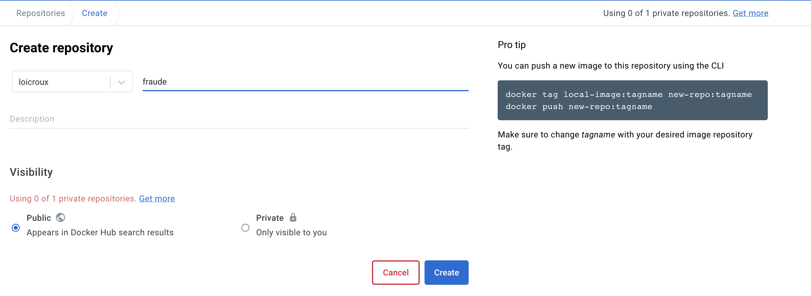

<div style="display: flex; width: 100%; text-align: center;">
<h3 style="width: 20%">

[Précédent](3-terraform-azure.md)
</h3>

</div>

## Helm chart

Pour rappel helm est le gestionnaire de packages pour Kubernetes. Il vous aide à piloter Kubernetes à l’aide de cartes de navigation, appelés Charts en anglais. Nous allons donc en créer une pour le microservice que nous avons créé.

Une chart est une collection de fichiers organisés dans une structure de répertoire spécifique. Ces fichiers décrivent un ensemble de ressources Kubernetes et leur configuration de manière dynamique.

Une instance exécutée d'une chart avec une configuration spécifique est appelée une release.

Ce chart sert à implémenter les fonctionnalités d'un ensemble de manifests kubernetes `deployment,service,ingress`. Nous n'allons pas aller trop loin et nous contenter de seulement ces fonctionnalités de déploiement. Nous aurons un chart générique que l'on va utiliser pour chaque micro services.

### Installation

Sur Linux / mac
```bash
curl https://raw.githubusercontent.com/helm/helm/main/scripts/get-helm-3 | bash
```

Si vous utilisez homebrew : `brew install helm` 

On vérifie avec `helm --version`

### Création d'un chart pour un microservice

```bash
helm create chart-ms
```

Dans le répertoire `chart-microservices` nous avons :

- un répertoire `templates` qui contient les fichiers de déploiement. 
- un fichier `Chart.yaml` qui contient les informations sur le chart
- un fichier `values.yaml` qui contient les valeurs par défaut du chart

Nous allons donc modifier notre `values.yaml` pour mettre en place plusieurs microservices et les déployer avec un seul chart.
Tou d'abord il va falloir que nos containers soit déployer sur un registre, nous allons utilisé docker hub pour placer des containers générés construit automatiquement par le module `buildImage` de spring.

Dans ce chart nous allons mettre en places des défaut pour faire fonctionner directement les microservices sur la paas sans configurations supplémentaires.

On change donc seulement les valeurs par défaut du ingress pour qu'il utilise traefik et le cert-manager de notre paas.

[chart/values.yaml](chart/values.yaml#L46)

```yaml
  annotations:
    kubernetes.io/ingress.class: traefik
    cert-manager.io/cluster-issuer: letsencrypt-acme-issuer
```


### Déploiement des containers pour les utiliser

Tout d'abord rancher (docker) doit être lancé avant de déployer les containers et vous devez vous placer dans votre projet maven / spring boot.

Enuite connectez vous à votre docker hub avec `docker login` et créez un repository pour chaque microservice. Voici un exemple pour le microservice `fraude`.



Ensuite dans le dossier d'un microservice lancer la commande maven suivante. (on est toujours sur l'exemple du microservice `fraude`)

```bash
mvn spring-boot:build-image -Dspring-boot.build-image.imageName=loicroux/fraude
```

Le build devrait se terminé par un message comme celui ci :

```bash
 Successfully built image 'docker.io/loicroux/fraude:latest'
```

### Déploiement du chart

Si vous n'avez pas suivi le tutoriel en utilisant un repository git, vous pouvez créer un repository sur github [ici](https://github.com/new) et y ajouter le chart. Ceci vous permettra de mettre à disposition un repository helm grâce github pages. Ainsi vous pourrez utiliser le chart sur votre cluster kubernetes.

> Nous utiliserons l'outil CD [chart_releaser_action](https://helm.sh/docs/howto/chart_releaser_action/) développé pour automatisé la publication de chart avec github actions (CI/CD)

```bash
git clone https://github.com/my-org/my-repo
cd my-repo
git add .
git commit -m "chore: Helm chart"
git push
```

Ensuite créer une branche pour github pages :

```bash
git checkout --orphan gh-pages
git push -u origin gh-pages
# On revient sur la branche main et on laisse celle-ci aux mains de chart releaser action
git checkout -
```

Puis on créer un fichier `.github/workflows/release.yml` dans lequel on met en place l'automatisation de la publication du chart.

```bash
mkdir -p .github/workflows
touch .github/workflows/release.yml
```

[.github/workflows/release.yml](../.github/workflows/release.yml)

```yaml
name: Release Charts

on:
  push:
    branches:
      - main

permissions:
  contents: write
  packages: write
  pages: write

jobs:
  release:
    runs-on: ubuntu-latest
    steps:
      - name: Checkout
        uses: actions/checkout@v2
        with:
          fetch-depth: 0

      - name: Configure Git
        run: |
          git config user.name "$GITHUB_ACTOR"
          git config user.email "$GITHUB_ACTOR@users.noreply.github.com"

      - name: Run chart-releaser
        uses: helm/chart-releaser-action@v1.4.1
        env:
          CR_TOKEN: "${{ github.token }}"
```

> On a bien précisé que le token créer pour un job github action a la **permission d'écrire sur les pages github**.


```bash
git add .
git commit -m "chore: chart releaser action"
git push
```

<div style="display: flex; width: 100%; text-align: center;">
<h3 style="width: 20%">

[Recommencer](#déploiement-final-sur-azure-avec-terraform)
</h3>

<div style="width: 35%"></div>

<h3 style="width: 40%">

[Suivant - Faq et exercices](5-allez-plus-loin.md)
</h3>
</div>
