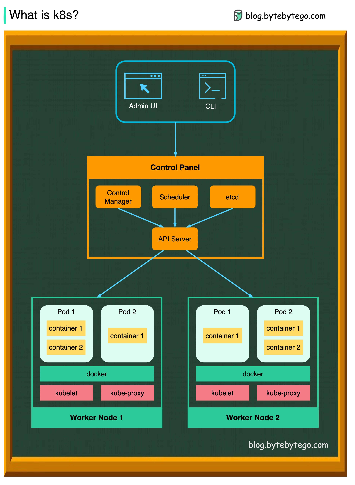

# 1.2 Présentation de K3s et installation

---

K3s est une distribution légère de Kubernetes conçue pour être facile à installer et à utiliser dans des environnements à ressources limitées tels que les appareils edge et IoT. Il convient également bien pour fonctionner sur des appareils basés sur Arm, ce qui en fait un choix populaire pour les grappes Raspberry Pi. 

K3s peut exécuter toutes les charges de travail Kubernetes, mais il a une empreinte plus petite et nécessite moins de ressources qu'une installation Kubernetes traditionnelle.

### Notions théoriques sur kubernetes

### Noeud

Un nœud est une machine de travail dans Kubernetes, un groupe de nœud va composer ce qu'on appelle un cluster (grappe) de serveurs. Chaque nœud contient les services nécessaires à l'exécution de pods et est géré par les composants du master.

> **Note** dans notre cas nous ferons appel à un seul noeud master

### Namespace

Clusters virtuels présents sur le même cluster physique. Ces clusters virtuels sont appelés namespaces. Ils utilisent les fonctionnalités de groupage de linux Cgroup.

### Les pods

[source documentation officielle](https://kubernetes.io/fr/docs/concepts)

Un pod est un groupe d'un ou plusieurs conteneurs (comme des conteneurs Docker), ayant du stockage/réseau partagé et une spécification sur la manière d'exécuter ces conteneurs. Les éléments d'un pod sont toujours co-localisés et co-ordonnancés, et s'exécutent dans un contexte partagé. Un pod modélise un "hôte logique" spécifique à une application - il contient un ou plusieurs conteneurs applicatifs qui sont étroitement liés.

Un pod peut être :
- Temporaire (Completed) pour effectuer une tâches particulière (cron, jouer des script, déploiement d'autres pods...)
- Définitif soit une application en exécution

### Déploiement

Comme un le fait en développement un fichier docker-compose, cette ressource décrit la mise en place des containers avant de les placer dans un pod (plusieurs containers peuvent se placer dans un pod)

### Services
Une manière abstraite d'exposer une application s'exécutant sur un ensemble de Pods en tant que service réseau.

## Ingress

Il s'agit du composant de kubernetes permettant de gérer au travers d'une technologie de reverse proxy et de répartition de charge le trafic réseau entrant (http(s)).

> **Note** Un **reverse proxy** est à l'inverse d'un proxy chargé d'effectuer une action à partir d'une requête réseau externe. On l'utilise majoritairement avec un serveur DNS qui fait pointer des noms de domaines et sous domaines vers l'adresse Ip du serveur sur lequel un reverse proxy est installé.
> Par exemple, il va servir à rediriger le traffic de la requête `kubeapps.k3s.local` vers une adresse et port réseau attribué par kubernetes à un pod.

Voici pour résumer l'achitecture réseau d'un cluster kubernetes :



## Spécificité de k3s

K3s est une sorte d'implémentation alléger de kubernetes pour le rendre portable sur plus de plateformes comme des nano ordinateur et des infrastructures en périphérie de réseau (Edge computing).

Nous avons donc à la place de `etcd` comme outil de persistance du stockage `sqlite`, un ingress (ou reverse proxy) par défaut à `traefik` et on trouve nombreux composants coeur comme le kuber-controller-manager ou le scheduder ramené au plus proche du système (services réseaux au lieu de pods).

## L'architecture autour de Kubeapps

Pour rappel kubeapps nous sert à déployer des applications conteneurisées "packagées" au format helm chart dans un cluster kubernetes.
Il aura besoin de plusieurs autres outils pour fonctionner de manière sécurisée avec kubernetes.

- Une autorité de certification locale et Acme server pour nos tests [pebble](https://github.com/letsencrypt/pebble)
- Un gestionnaire de certificats dédié à kubernetes [cert-manager](https://cert-manager.io/)
- Un **serveur openid** exploitant une application oauth2 github : [dex idp](https://dexidp.io/)

Voilà donc tout ce qu'on aura à mettre en place dans notre rôle ansible.

### E. Premiers tests sur le rôle 

Nous allons d'abord définir l'utilisation d'une distribution ubuntu pour installer nos outils. Pour les tests en local, nous faisons du **docker in docker** ce qui impose des configurations particulières.

```yaml linenums="1" title="playbook/roles/kubeapps/molecule/default/molecule.yml"
---
dependency:
  name: galaxy
driver:
  name: docker
platforms:
  - name: node-0
    image: geerlingguy/docker-${MOLECULE_DISTRO:-ubuntu2004}-ansible:latest
    command: ${MOLECULE_DOCKER_COMMAND:-""}
    privileged: true
    pre_build_image: true
    volumes:
      - /sys/fs/cgroup:/sys/fs/cgroup:rw
      - /var/lib/rancher/k3s
    network_mode: host
    tmpfs:
      - /var/run
      - /run

provisioner:
  name: ansible
verifier:
  name: ansible

```

> **Warning** : le `name` de la platform va nous servir d'adresse réseau par laquelle ansible sur l'hôte va pouvoir accéder en ssh. Il est indispensable de le renseigner, car le role k3s en a besoin pour bien créer les nœud du cluster kubernetes. (même si on en utilise un seul)

L'image du container `geerlingguy/docker-${MOLECULE_DISTRO:-ubuntu2004}` va nous permettre d'utiliser un linux préconfiguré qui s'initialise avec le démon `systemd`. Celui ci est une fonctionnalité assez neuve du coeur et recommandée pour la gestion des services en arrière plan (daemons) soit ici k3s

On note que l'on publie le port `80` et `443` à des fins de debug pour exposer Ingress.

> `32444` le port pebble servira plus tard pour accéder à notre serveur ACME

> ****Warning** vérifie bien qu'aucun autre processus su votre machine n'utilise déjà le port 80 et 443**

Les **volumes** que l'on utilise servent à rendre disponible des fonctionnalités du coeur linux désactivées par défaut sur des containers docker comme `systemd` et les [espaces de nom](https://fr.wikipedia.org/wiki/Espace_de_noms) / [`cgroup` version 2](https://kubernetes.io/docs/concepts/architecture/cgroups/). 
Même chose pour le répertoire temporaire `tmpfs` qui assurent le bon fonctionnement de ces outils. 
Enfin `priviledgied: true` nous donne les droits administrateur complets sur le système du container.

Le playbook `verifier` va ensuite nous permettre de tester la bonne exécution du rôle et de ses dépendances.

#### Le playbook converge

Ce playbook représente la façon dont on utilisera en condition réelle notre appel du rôle en ajoutant cependant des prérequis spécifique à notre environnement de test.

> **Note** la partie `dig_host_docker_internal` servira à récupérer l'adresse ip de l'hôte docker pour pouvoir y accéder depuis les pods. C'est une astuce pour contourner le problème de résolution de domaines des pods avec un réseau sur localhost. C'est grâce à `network_mode: host` que l'on peut faire cela.

```yaml linenums="1" title="playbook/roles/kubeapps/molecule/default/converge.yml"
---
- name: Converge
  hosts: all
  become: true
  vars:
    molecule_is_test: true

  roles:
    - role: "{{ lookup('env', 'MOLECULE_PROJECT_DIRECTORY') | basename }}"

  pre_tasks:
    - name: Ensure test dependencies are installed.
      package: 
        name:
          - iptables
          - curl
          - dnsutils
        state: present
        update_cache: true
      when: ansible_os_family == 'Debian'

    - name: Install pre-requisites for k8s module
      ansible.builtin.pip:
        name:
          - openshift
          - pyyaml
          - kubernetes

    - name: dig host.docker.internal address
      command: dig +short host.docker.internal
      register: dig_host_docker_internal
      changed_when: false
      tags: [kubeapps]

    - ansible.builtin.set_fact:
        kubeapps_internal_acme_network_ip: "{{ dig_host_docker_internal.stdout }}"
      tags: [kubeapps]

```

> Notes :
> - `hosts: all` permet de jouer le playbook sur tous les hôtes
> - `role: {{etc...}}` résoud le chemin de fichier vers le répertoire du rôle
> - Les pré-tâches servent à installer des packages linux et python manquant à notre container utiles pour l'environnement local et les tests.

#### Le playbook verify

Nous allons ensuite vérifier que k3s est bien prêt avec deux vérifications :

- Vérification de la bonne initialisation du nœud **master** 
simplement en vérifiant que le retour de la commande contient bien "Ready    master".

On utilise pour cette fois la commande `kubectl` directement. Pour en savoir plus pour cette commande centrale dans l'utilisation d'un cluster kubernetes [c'est ici](https://kubernetes.io/docs/reference/generated/kubectl/kubectl-commands)

```yaml linenums="1" title="playbook/roles/kubeapps/molecule/default/verify.yml"
---
- name: Verify
  hosts: all
  gather_facts: false
  tasks:
    - name: Get single node
      command: kubectl get nodes
      changed_when: false
      register: kubernetes_nodes

    - name: Print list of running nodes.
      debug: var=kubernetes_nodes.stdout

    - name: Assert master node ready
      ansible.builtin.assert:
        that: '"node-0   Ready    control-plane,master" in kubernetes_nodes.stdout'

```

Lancer votre premier test avec `molecule test` et voilà vous avez un playbook offrant un cluster kubernetes prêt à l'emploi tout en suivant rigoureusement le concept du test driven development pour plus de fiabilité.

> **Note** : Vous pouvez aussi lancer `molecule test --destroy never` pour ensuite garder le conteneur et debugger l'état du système après le "provision" ansible avec `molecule login` (qui équivaut à `docker exec -it node-0 bash`)

> **Note** : En cas d'erreur `export ANSIBLE_STDOUT_CALLBACK=yaml` avant de lancer `molecule test` pour avoir un meilleur rendu de la possible erreur.

Ensuite dans la suite du fichier on procède à une vérification des pods de la suite k3s. 

> Vous pourrez relancer seulement la suite de vérification avec `molecule verify` si votre container n'a pas été détruit (`--destroy false`)

Nous savons ici que k3s est lancé. En sachant que ce rôle est externe nous n'avons pas besoin de faire plus de tests sur ces composants centraux disposés dans le namespace `kube-system`.

On valide bien que le service est de type cluster ip. Cela signifie qu'il est exposé dans le cluster avec sa propre adresse. Si le type aurait été vide cela aurait voulu dire soit que quelque chose n'est pas correctement configuré soit que kubernetes n'est pas disposé à attribué une configuration réseau à ce service.

> **INFO** Kubernetes utilise l'outil natif de linux `iptables` pour faire fonctionner cette ressource.


#### [Optionnel - Utilisation avec les extensions Vscode](5-allez-plus-loin.md#kubernetes-sur-vscode)

---