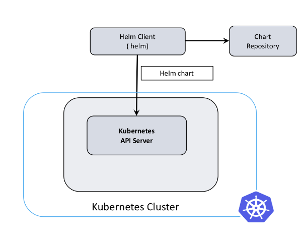

# 1.3 Algo d'installation des manifests

---

Nous allons avoir recours ici à deux nouvelles notions de l'écosytème de kubernetes qui sont

- Les manifests que l'on utilise pour décrire une resources (déploiement, service, pods, ingress,...) à déployer dans le cluster avec la commande `kubectl`

Pour l'exemple cette commande `kubectl get pods -n kube-system` récupère la liste des pods dans le namespace du système de k3s
Voici le retour qu'elle nous donne :

```
  "local-path-provisioner-84bb864455-8dz4g   1/1     Running     0          7h58m",
  "svclb-traefik-qv89r                       2/2     Running     0          7h57m",
  "coredns-574bcc6c46-pr6vq                  1/1     Running     0          7h58m",
  "metrics-server-ff9dbcb6c-ncr4n            1/1     Running     0          7h58m",
  "traefik-56c4b88c4b-p4xt6                  1/1     Running     0          7h57m",
```

Les commandes kubectl fonctionnent tout le temps de la sorte `kubectl <action> <resource> -n <namespace> -o <format>`

- `<action>` soit une action crud : `edit`, `get`, `describe`
- `<resource>` pour en savoir plus sur les différentes ressources disponibles `kubectl api-resources`. Nous aurons majoritairement recour à `deployment`, `service`, `ingress`, `pod`, `secret`, `configmap`
- `-o` est très pratique quand on veut un vrai détail sur les resources avec notamment le `-o yaml`

> La commande pod est un peu particulière : voici un exemple utilisant le retour au dessus en exemple : `kubectl get pods -n kube-system traefik-56c4b88c4b-p4xt6` (on précise le nom complet du pod)

> Astuce le flag `-A` permet de regarder tous les pod sur n'importe quel namespace. Par exemple `kubectl get po -A` (`po` est un diminutif de `pods`, on a aussi par exemple `svc` pour service)

- [Helm](https://helm.sh/fr/docs/intro/using_helm/) un gestionnaire de paquet pour distribuer des **charts** (ou package) contenant des suites de manifest kubernetes à déployer sur le cluster.
Pour cela nous aurons recour à cette utilisation au travers de k3s et d'un [module `helm.cattle.io/v1`](https://docs.k3s.io/helm#automatically-deploying-manifests-and-helm-charts) permettant le deploiement automatique de resources kubernetes.



Donc dans [playbook/roles/kubeapps/tasks](../playbook/roles/kubeapps/) nous allons travailler sur ces éléments de ansible :

- `tasks/main.yaml`: déclenche certaines suite de tâches en fonction de l'état choisi dans les variables de configuration. Elles sont définis dans l'ordre :

- Les variables par défaut `default/main.yaml`. On pourra par la suite les surcharger avec celle du playbook (inventories/{env}/all.yaml)

- Les variables par défaut `default/vars.yaml` sont comme default/main.yaml mais pour des variables non configurables.

- `templates/` qui contient des fichier `.j2` ou templates `jinja` représentant plusieurs manifests kubernetes.

- `tasks/manifests.yaml` : celui-ci va s'occuper de placer les manifests kubernetes dans le répertoire `/var/lib/rancher/k3s/server/manifests` pour que k3s déploie automatiquement les resources décrites dans ceux-ci.

> Source pour plus d'informations [doc k3s](https://docs.k3s.io/helm#customizing-packaged-components-with-helmchartconfig)

On rempli le fichier d'entrée comme ceci :

```yaml linenums="10" title="playbook/roles/kubeapps/tasks/main.yml"
---
- include_tasks: manifests.yml
  tags: [kubeapps]
```

> Astuce: Voici la commande molecule qui permettra de lancer seulement les taches avec le `tags: [kubeapps]` ceci une fois notre playbook utilisable :

```bash
molecule test --destroy never -- -t kubeapps
```

Puis allons configurer une suite de tâches pour installer les manifests qu'ils soit une ressource api ou un chart helm.

On commence par mettre en place une boucle ansible prenant en paramètre une liste de dictionnaires python. Ceux-ci comportes comme sous propriétés définissants la façon dont notre programme se comporte :

- `src` : un fichier manifest au format `yaml.j2` à déployer sur le noeud. Ce format donne la possibilité d'intégrer les `variables` et `facts` ansible. 
- `ns` : pour un namespace sur lequel ajouter le chart et pouvant aussi être un déploiement kubernets dont il va valloir attendre le succès.
- `deploy`: Pour préciser le nom du déploiement ci celui-ci n'est pas le même que le namespace 
- `condition`: Simple booléen pour executé ou non le manifest

> **Note** Les facts sont des variables définis dynamiquement à partir de l'environnement ou de ce qu'on décide de conserver de nos traitement pendant le processus ansible

```yml linenums="10" title="playbook/roles/kubeapps/tasks/manifests.yml"
---
- name: "Deploy {{ item.src }} to k3s crd processor"
  ansible.builtin.template:
    src: "{{ item.src }}.j2"
    dest: "/var/lib/rancher/k3s/server/manifests/{{ item.src }}"
    owner: "{{ kubeapps_user }}"
    group: "{{ kubeapps_user }}"
    mode: '0644'

- name: "Wait {{ item.src }} deployment complete"
  kubernetes.core.k8s_info:
    api_version: v1
    kind: Deployment
    name: "{{ item.deploy }}"
    kubeconfig: /etc/rancher/k3s/k3s.yaml
    wait: yes
    wait_sleep: 5
    wait_timeout: 600
    wait_condition:
      type: Progressing
      status: "True"
      reason: "NewReplicaSetAvailable"
    # Many times deployment name is the same that namespace
    namespace: "{{ item.ns | d(item.deploy) }}"
  when: item.deploy | default(false) or item.ns | default(false)
  register: deployment_infos

```

Pour expliquer l'utilisation du module ansible [kubernetes.core.k8s_info](https://docs.ansible.com/ansible/latest/collections/kubernetes/core/k8s_info_module.html). On attend que le retour de la commande `kubectl` reformatés en json atteigne des conditions.
Ces conditions sont ici testées toutes les 5 secondes (`wait_sleep`) et vont rendre une erreur si elles ne sont toujours pas bonnes au bout de `350s`.

Voici ensuite ce qui est rendus entièrement par le `deployment_infos` dans la directive `register` qui permet à ansible de stocker ce **fact / variable**.

Voici un exemple de retour pour un déploiement fonctionnel pour mieux comprendre.

```yaml
  "conditions": [
      {
          "lastTransitionTime": "2022-12-05T15:11:56Z",
          "lastUpdateTime": "2022-12-05T15:11:56Z",
          "message": "Deployment has minimum availability.",
          "reason": "MinimumReplicasAvailable",
          "status": "True",
          "type": "Available"
      },
      {
          "lastTransitionTime": "2022-12-05T15:11:46Z",
          "lastUpdateTime": "2022-12-05T15:11:56Z",
          "message": "ReplicaSet \"dex-5bd6ffdfd\" has successfully progressed.",
          "reason": "NewReplicaSetAvailable",
          "status": "True",
          "type": "Progressing"
      }
  ],

```

On remarque que le `status` à "True" signigie que nous avons réussi, que la `reason` indique qu'un replica à été créer. Un replica est une instance de pod dans un contexte ou l'on peut dupliquer les pod pour répartir la charge.

> **Note** la commande k8s_info donne tous les états par lesquels sont passé le pod. On voit ici le passage de `Available` à `Progressing` qui signifie que le déploiement est fonctionnel. (le wording est un peu étrange mais c'est comme ça).

Revenons à la déclaration de la boucle des manifests pour ajouter le la liste `loop` que l'on laise avec des null en propriétés pour l'instant.
De plus le `when` permettra de ne pas executer certains manifests en fonction des conditions que l'on aura définis avec `condition`.

```yaml linenums="10" title="playbook/roles/kubeapps/tasks/manifests.yml"
---
- import_tasks: manifests.yml
  tags: [kubeapps]
  when: item.condition | default(true)
  args: { apply: { tags: [kubeapps] } }
  loop:
    - { src: ~, ns: ~, condition: True, deploy: ~ }
```

---
