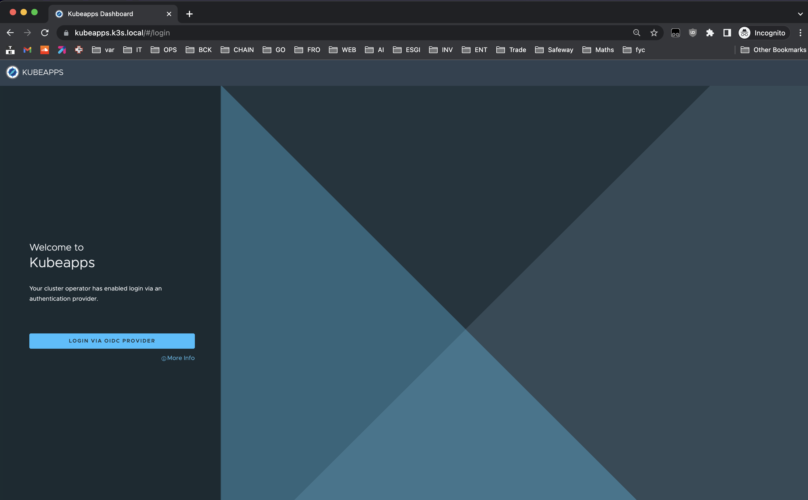
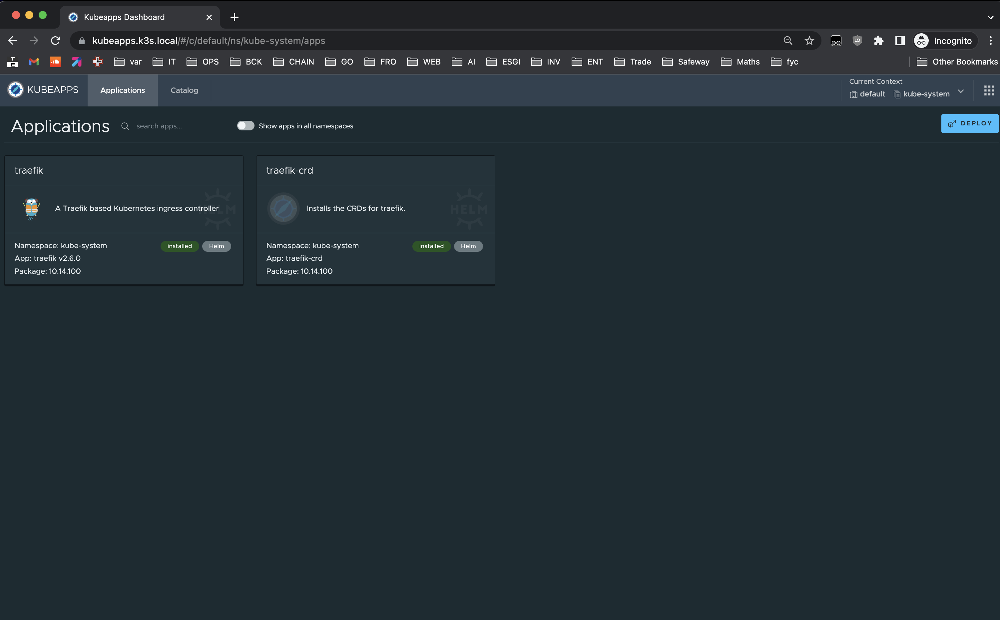

# 1.9 Installation de kubeapps

---

Commençons par construire notre manifest. Pour cela nous avons besoin de définir plusieurs variables pour rendre configurable l'utilisation de notre rôle :

Dans [playbook/roles/kubeapps/defaults/main.yml](playbook/roles/kubeapps/defaults/main.yml) on aura donc :

- `kubeapps_namespace` pour définir le namespace à créer et sur lequel on déploie kubeapps

- `kubeapps_user` définit à `ansible_user` une variable censé être définie dans un playbook de production dans le fichier host. Par défaut on le met à `root` si la variable n'existe pas.

- `kubeapps_hostname` pour choisir à quel url sera disponible kubeapps.

> Par défaut kubeapps sera disponible sur `kubeapps.k3s.local`

```yaml linenums="22" title="playbook/roles/kubeapps/defaults/main.yml"
---
# HelmChart Custom Resource Definition for kubeapps variables
kubeapps_namespace: kubeapps
kubeapps_user: "{{ ansible_user | default('root') }}"
kubeapps_hostname: kubeapps.k3s.local
```

Ensuite nous allons utiliser toutes ces variables dans un manifest kubernetes qui inclus deux resources. Un namespace et une définition de dépendance helm avec sa configuration.

> **Note** sur le templating jinja dans la moustache `{{}}` rajouter un `-` signifie qu'on ignore le format du côté où l'on utilise. Par exemple un retour à la ligne (colonne 0) sera ignorer pour `-}}`.

```yaml linenums="1" title="playbook/roles/kubeapps/templates/kubeapps-chart-crd.yml.j2"
apiVersion: v1
kind: Namespace
metadata:
  name: {{ kubeapps_namespace }}
---
apiVersion: helm.cattle.io/v1
kind: HelmChart
metadata:
  name: kubeapps
  namespace: kube-system
spec:
  chart: kubeapps
  targetNamespace: {{ kubeapps_namespace }}
  repo: https://charts.bitnami.com/bitnami
  valuesContent: |-
    ingress:
      tls: true
      enabled: true
      hostname: "{{ kubeapps_hostname }}"
      annotations:
        cert-manager.io/cluster-issuer: letsencrypt-acme-issuer
        kubernetes.io/ingress.class: "{{ kubeapps_k8s_ingress_class }}"
        traefik.frontend.passHostHeader: "true"
        traefik.ingress.kubernetes.io/router.tls: "true"

```

> **Note** On configure le ingress directement dans la définition helm tout en précisant bien que l'on utilise traefik en sachant que par défaut il est souvent utilisé `nginx` comme controller ingress

Nous allons lancer la commande de templating grâce au module `template` de la collection **builtin** (fonctionnalités incluses par défaut) de ansible.

Celle ci va faire le remplacement des variables utilisées dans les moustaches `{{}}` et placer le fichier au bon endroit dans notre machine invité. Ici, il se trouvera dans notre container `node-0` dans le répertoire `/var/lib/rancher/k3s/server/manifests/kubeapps-chart-crd.yml`

```yaml linenums="23" title="playbook/roles/kubeapps/tasks/main.yml"
    - src: kubeapps-chart-crd.yml
      deploy: "{{ kubeapps_namespace }}"

```

Pour vérifier que les pods de kubeapps sont bien prêt :

- On regarde d'abord si la tâche `helm` a bien pu se finir

```bash
kubectl get po -n kube-sysem --watch
```
Devrait donné au bout de quelque minutes : `helm-install-kubeapps-4cdf8` avec status `COMPLETED`

##### Ensuite connexion à dex Idp pour s'authentifier avec github

Pour ajouter la couche d'authentification kubeapps fait appel à la solution [oauth2-proxy](https://oauth2-proxy.github.io/oauth2-proxy/docs/configuration/oauth_provider#github-auth-provider). Il s'agit donc d'un reverse proxy qui redirige le trafic http d'un client à un serveur implémentant oauth2 avant de permettre la connexion à kubeapps.

Cette authentification est associée à un cookie converti en base64 à partir d'un secret que l'ont définie avec une commande simple : 

```bash
echo "not-good-secret" | base64
```

```yaml linenums="30" title="playbook/roles/kubeapps/defaults/main.yml"
# ...
# Cookie secret
kubeapps_oauth_proxy_cookie_secret: bm90LWdvb2Qtc2VjcmV0Cg==
```

`--oidc-issuer-url` est obligatoire quand l'on n'utilise pas un fournisseur d'authentification pré-conçu comme github, gitlab, google, etc. Il faut donc le définir avec l'url de `dex` pour qu'il soit bien consommé par le client openid de oauth2-proxy.

> Note : Pour consulter la configuration d'open id vous pouvez ouvrir l'url [dex.k3s.local/.well-known/openid-configuration](https://dex.k3s.local/.well-known/openid-configuration) dans votre navigateur.

Ensuite on réutilise nos secrets de **dex idp** pour créer et configurer l'accès du container `authProxy` à open id dans le pod `frontend` de kubeapps.

```yaml linenums="28" title="playbook/roles/kubeapps/templates/kubeapps-chart-crd.yml.j2"
    authProxy:
      enabled: true
      provider: oidc
      clientID: "{{ dex_client_id }}"
      clientSecret: "{{ dex_client_secret }}"
      cookieSecret: '{{ kubeapps_oauth_proxy_cookie_secret }}'
      cookieRefresh: 5m
      extraFlags:
        - --oidc-issuer-url=https://{{ dex_hostname }}
```

Enfin maintenant que notre chart est déployé avec un combo **oauth-proxy** / **dex** fonctionnel nous allons configurer le contrôle d'accès à l'administration du cluster. Nous utilisons pour cela une ressource `ClusterRoleBinding` pour lier un groupe d'une organisation github à un rôle `cluster-admin` qui lui donne tous les droits sur le cluster.

```yaml linenums="1" title="playbook/roles/kubeapps/templates/kubeapps-chart-crd.yml.j2"
---
apiVersion: rbac.authorization.k8s.io/v1
kind: ClusterRoleBinding
metadata:
  name: kubeapps-github-teams
roleRef:
  apiGroup: rbac.authorization.k8s.io
  kind: ClusterRole
  name: cluster-admin
subjects:
  - kind: Group
    name: "{{ dex_github_client_org }}:{{ dex_github_client_team }}"

```

Nous voilà prêt à tester notre déploiement de kubeapps. Nous allons donc lancer notre test molecule et attendre son exécution :

```bash
molecule test --destroy never
```

Une fois l'exécution terminée, il faut attendre quelques secondes pour que tous les pods soient bien prêts. On peut alors se connecter à l'interface web de kubeapps en se connectant à l'adresse [https://kubeapps.k3s.local](https://kubeapps.k3s.local) et en utilisant notre compte github nous allons pouvoir nous connecter.

Voici la page de login attendue :



Et voici la page de dashboard de kubeapps une fois connecté :



### Mise en place des tests de kubeapps

Grâce au module ansible [k8s info](https://docs.ansible.com/ansible/latest/collections/kubernetes/core/k8s_info_module.html) on teste les pods centraux de kubeapps. Si ces pod sont bien en état `ready`, c'est que kubeapps est prêt

> On note qu'il est important de préciser à `k8s_info` la localisation kubeconfig qui se trouve à un endroit un peu exotique avec k3s. Cette config comporte des informations utilisateur et des certificats permettant de se connecter sur le cluster.

```yaml linenums="18" title="playbook/roles/kubeapps/molecule/default/verify.yml"
    - name: Get Kubeapps service infos
      kubernetes.core.k8s_info:
        api_version: v1
        kind: Pod
        label_selectors:
        - app.kubernetes.io/component = frontend
        kubeconfig: /etc/rancher/k3s/k3s.yaml
        namespace: kubeapps
      register: kubeapps_infos

    - ansible.builtin.set_fact:
        containers_statuses: "{{ (kubeapps_infos.resources | last).status.containerStatuses }}"

    - ansible.builtin.debug:
        msg: "{{ containers_statuses | map(attribute='name') }}"

    - name: Assertions on service kubeapps 
      assert:
        that:
          - kubeapps_infos.resources | length > 0
          - containers_statuses | selectattr('ready', 'equalto', true) | list | count == 2

```

Si votre playbook est déjà passé en entier un `molecule verify` va suffire pour jouer le playbook `verify.yml`.

Vous devriez voir passer les assertions et les autres tâches.

Pour autant vous ne verrez pas encore de retour de ce type tout simplement par ce que le code n'est pas complet.

```
node-0                     : ok=15 ...
```

---
