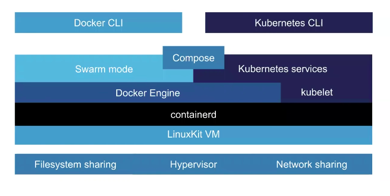

# Introduction et installation

---

L'objectif de ce tutoriel est de vous permettre de créer sur une petite machine ou sur un serveur personnel un PaaS (Platform as a service). Un PaaS permet de déployer des applications en microservices. Celui-ci sera basé sur [kubernetes](https://kubernetes.io/fr/) pour la conteneurisation et [Kubeapps](https://kubeapps.dev/) pour l'interface de déploiement.

L'optique de cet outillage suivra :

- le principe **d'immutable infrastructure** avec l'idée de recréer plutôt que de mettre à jour. Ainsi nous aurons recour à des iso linux déjà prêt pour déployer la plateforme **kubernetes** / **kubeapps** directement sur un serveur.

- Le principe **d'infrastructure as code** (IaC) en gardant toutes la spécification de notre infrastructure dans des configurations et scripts. On utilisera également des tests basiques de nos configurations.

Pour cela nous ferons appel à un socle technique composé de :

- l'outil [`k3s`](https://k3s.io/) qui simplifie l'installation de kubernetes sur des machines ARM tout en restant compatible avec les architectures classiques X64. Il fourni par défaut des pods (containers en execution) pour inclure des fonctionnalités souvent recherchés sur ce type de configuration edge computing. (reverse proxy, configuration DNS...)
- [Packer](https://www.packer.io/) pour créer des images iso de machine linux
- [Ansible](https://www.ansible.com/) pour provisioner cette image
- [Terraform](https://www.terraform.io/) pour contrôler azure de manière IaC et de déclencher toute la mise en place du PaaS dessus.

## Installation de Docker

Pour rappel l'architecture de base de docker :


> Source documentation docker

et les couches des systèmes de conteneurisation docker et kubernetes :



## Rancher comme alternative à docker desktop

[**Rancher**](https://rancherdesktop.io/) l'alternative mieux configurée et sans soucis de license à docker desktop. Il est portable sur windows et mac et nous permet d'avoir une expérience docker complète et fonctionnelle sur notre machine.

Dans les choix proposés dans la mise en place :
- **Décocher kubernetes**
- Choisissez **dockerd** comme moteur de conteneurisation

Vérifier que vous avez bien la commande `docker` disponible sinon ajouter `~/.rd/bin` à votre `PATH` :

```bash
echo 'export PATH="$PATH:$HOME/.rd/bin"' >> ~/.zshrc
```

## Installation de l'environnement python

**Maintenant tout ce que nous allons faire se trouve dans la ligne de commande sur un shell `bash` ou `zsh`**

**Conda** : [docs.conda.io](https://docs.conda.io/en/latest/miniconda.html). Installer simplement avec le setup `.pkg` pour mac.

> utilisez la ligne de commande ci-dessous pour l'installer
```bash
wget https://repo.anaconda.com/miniconda/Miniconda3-latest-Linux-x86_64.sh -P /tmp
chmod +x /tmp/Miniconda3-latest-Linux-x86_64.sh
/tmp/Miniconda3-latest-Linux-x86_64.sh -p $HOME/miniconda
```

> Pour arm :
```bash
wget https://repo.anaconda.com/miniconda/Miniconda3-py39_4.12.0-Linux-aarch64.sh -P /tmp
chmod +x /tmp/Miniconda3-py39_4.12.0-Linux-aarch64.sh
/tmp/Miniconda3-py39_4.12.0-Linux-aarch64.sh -p $HOME/miniconda
```

Veillez à bien accepter toutes les propositions (licence terms, initialize Miniconda3).

Puis lancer `conda init zsh` (ou `bash` si vous préférez)

**Relancer votre shell pour appliquer** (commande `exec $SHELL`)

## Installation de vscode

- [Avec installer toutes plateformes](https://code.visualstudio.com/download)
- Homebrew sur mac `brew install --cask visual-studio-code`
- [Avec snap pour linux](https://snapcraft.io/code) sur linux

## Ansible playbook

```bash
cd playbook
ansible-galaxy install -r requirements.yml
cd -
```

Install ansible collection for contabo :

```bash
cd playbook/ansible_collections/k3s_paas/contabo
ansible-galaxy collection build --output-path /tmp
ansible-galaxy collection install /tmp/k3s_paas-contabo-1.0.0.tar.gz
```

## Packer image

```bash
PACKER_LOG=0 packer build -var-file "$(uname -ms | tr " " "-")-host.hcl" -var-file=secrets.pkvars.hcl ubuntu.pkr.hcl
```

> use `PACKER_LOG=1` for debug

Release image manually :

```bash
git tag "ubuntu-jammy-2204-$(git branch --show-current)-$(git rev-parse --short HEAD)"
git push --tags
```

Open release from tag on [this link](https://github.com/loic-roux-404/k3s-paas/releases/new)
