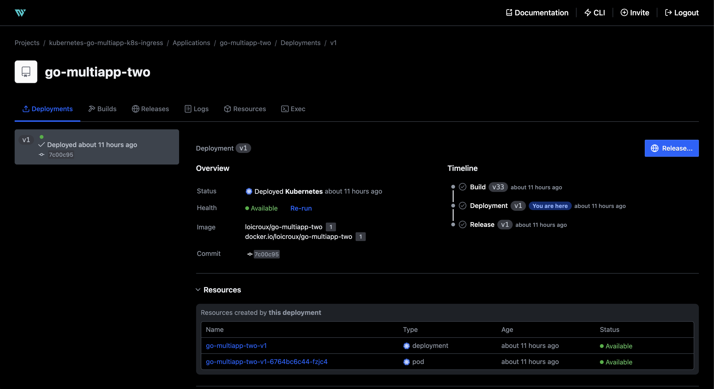
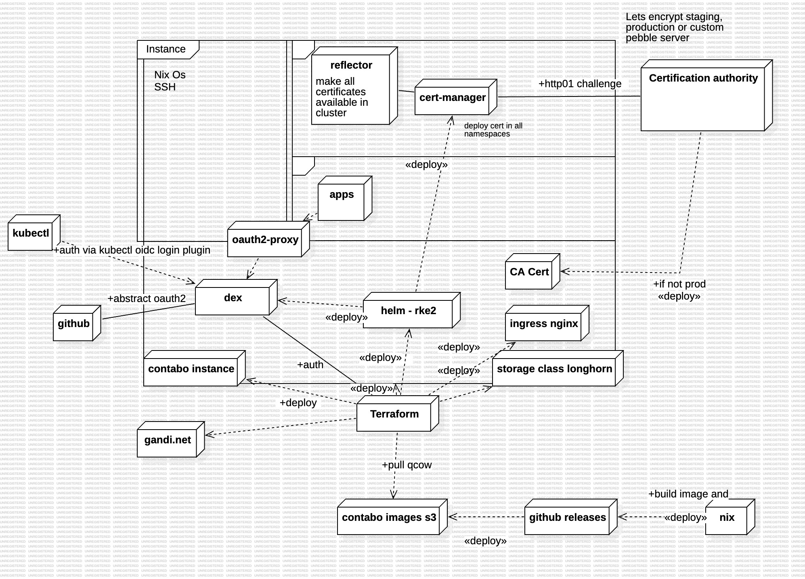

# Result

### Architecture

### Requirements

- A Contabo subscription [contabo](https://contabo.com)
- An account of the Dns provider [namedotcom](https://name.com)

> Note: You could easily adapt terraform to use another provider, it just needs to support `user_data` with a cloud-init compatible syntax.

> Note: For dns provider, it could be more complex but good terraform provider exists for namecheap, cloudflare, etc.

### Quick deploy with terraform

`cd terraform/`

Rename `prod.tfvars.dist` to `prod.tfvars` and fill variables (precision to find them are in file comments).

Then run `make apply`

## Index

- [1. Install](1-install.md)
- [2. Waypoint usage](1-install.md)
- [3. Help and more](3-help.md)
